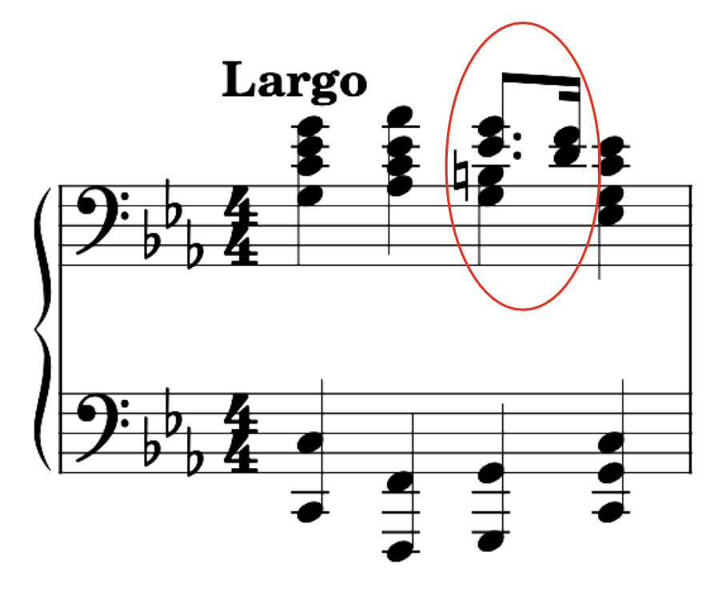

# MusicXML Overview

As alluded to earlier, MIDI really was never intended for storing/transmitting notation details. It is for performance details, which can vary from the score due to:

+ Artistic interpretation
+ Imperfect execution

If you export MusicXML data as a MIDI file, and play it back using a sequencer, it will sound robotic because it is "executing" score details literally. However, MusicXML and notation software are getting better at producing pretty decent-sounding MIDI based on a score. Additionally, these programs are providing more options to authors to meticulously control playback through score indications and various configurations.

So while there is a lot of overlap in what each can do, each paradigm has its focus and its strength:

+ Recorded MIDI is much more human-sounding, and aims to recreate performances, but is not great for specifying exact notation
+ MusicXML can create exactly notated scores, but playback is often robotic sounded, as playback is usually achieved via export-to-MIDI and sequencer playback


This project started out focused solely on MIDI, which is why the MusicXML portion is currently underdeveloped. It currently can convert a domain object (a
`Piece`) into a MusicXML document, which can be rendered as a score in notation software such as MuseScore 4.

There is some easily-transferable aspects of the MIDI domain to the MusicXML domain, and some not-so-easily-transferable aspects. See this [official documentation article](https://www.w3.org/2021/06/musicxml40/tutorial/midi-compatible-part/
).


# MusicXML Preamble

```xml
<?xml version="1.0" encoding="UTF-8" standalone="no"?>
<!-- (above) xml declaration -->
<!-- (below) doctype declaration -->
<!DOCTYPE score-partwise PUBLIC "-//Recordare//DTD MusicXML 4.0 Partwise//EN"
        "http://www.musicxml.org/dtds/partwise.dtd">
<!-- (below) root element for a MusicXML document -->
<score-partwise version="4.0">
    <!-- the goods -->
</score-partwise>
```

Note the `standalone="no"`, as MusicXML typically references an external DTD.

This project does not (currently) use a schema declaration (
`musicxml.xsd` can be downloaded for free), but if it did, instead of the doctype declaration:

```xml

<score-partwise version="4.0"
                xmlns="http://www.musicxml.org/ns/musicxml"
                xmlns:xsi="http://www.w3.org/2001/XMLSchema-instance"
                xsi:schemaLocation="http://www.musicxml.org/ns/musicxml
                        file:not/in/project/yet">
    <!-- the goods -->
</score-partwise>
```


# Structure

## Header

The first section within the
`<score-partwise>` element is known as the "score header" or simply "header", and contains a bunch of direct children representing various metadata.

+ There is one other "species" of root element, called
  `<score-timewise>`. It basically reverses the parent-child relationship between parts and measures (i.e. Measures contain Parts, and measures are added one at a time but contain all parts for that measure). It is rarely used.


It is all optional, save for one element: the `<part-list>` element, which contains
`<score-part>` elements and is basically a mapping for the rest of the document. It provides id's, the ability to give names to the parts (e.g. "trumpet"), specification of staff quantity, etc.


## Body

I have diagrammed it below, but also provided a barebones example in actual MusicXML below.

    ScorePartwise       
                        _
        Metadata 1       |
        Metadata 2       |---- score header
        ...              |
        Part-List       _|

        Part 1          
            Measure 1   
                Attributes
                Note
                    ...
                Note
                Note
                ...
            Measure 2
                ...
            Measure 3
                ...
        Part 2
            ...
        Part 3
            ...
    closing tags

And now in actual XML, with as little info as possible:

```xml
<?xml version="1.0" encoding="UTF-8" standalone="no"?>
<!DOCTYPE score-partwise PUBLIC "-//Recordare//DTD MusicXML 4.0 Partwise//EN"
        "http://www.musicxml.org/dtds/partwise.dtd">
<score-partwise version="4.0">
    <part-list>
        <score-part id="P1">
            <part-name>Piano</part-name>
        </score-part>
    </part-list>
    <part id="P1">
        <measure number="1">
            <attributes>
                <divisions>1</divisions>
                <key>
                    <fifths>0</fifths>
                </key>
                <time>
                    <beats>4</beats>
                    <beat-type>4</beat-type>
                </time>
                <clef>
                    <sign>G</sign>
                    <line>2</line>
                </clef>
            </attributes>
            <note>
                <pitch>
                    <step>C</step>
                    <octave>4</octave>
                </pitch>
                <duration>1</duration>
                <voice>1</voice>
                <type>quarter</type>
            </note>
        </measure>
    </part>
</score-partwise>
```


# MusicXML & Timing

MusicXML essentially follows the MIDI quarter-note resolution timing paradigm in that everything time-related is based on the value of a quarter note. Instead of resolution, it is just called
`divisions`, i.e., subdivisions per quarter note.


# Note Placement

## Example

(If you do not care to follow along with the example, you can jump to the next section.)

Most MusicXML stuff is pretty straightforward. Note placement can be relatively complex (programmatically, at least).

Consider the first measure of the [Chopin Cm](https://www.youtube.com/watch?v=XeX4X_1_lo0):

<div align="center">
    
</div>

You will notice that in `right hand --> beat 3`, there are two independent groupings of notes:

+ the quarter-note "base"
+ the moving melody above it

So, and including the left hand, we essentially have three "regions" of notes occurring at exactly the same time, but on disparate stems:


<div align="center">
    
</div>


## MusicXML vs. MIDI Paradigms

In MusicXML, notes are placed sequentially. At first glance, this sounds like it is essentially the same as MIDI. However, MusicXML uses a "caret"/"marker" system to keep track of where the current note is to be placed.

In MIDI, if I wanted to encode a C major triad in quarter notes with a resolution of 480:

    0: C4 ON --> 480: C4 OFF --> 0: E4 ON --> 480: E4 OFF --> 0: G4 ON --> 480: G4 OFF

and it would look like this:


<div align="center">
    
</div>


They are serial/sequential in the raw data, but the tick datum determines when a sequencer will play the note. The sequencer is "sequence-agnostic" when it comes to pitches meant to occur at the same time, i.e., chords.

It is all sequential, and it is up to the sequencing software to take that "flat map" and put everybody in their corrals and send them off at the right time during playback.

If you were to encode that *same* triad in MusicXML using the MIDI paradigm, it would like this...


<div align="center">
    
</div>


...where the XML looks something like this:

```xml

<note>
    <pitch>
        <step>C</step>
        <octave>4</octave>
    </pitch>
    <duration>480</duration>
    <voice>1</voice>
    <type>quarter</type>
    <staff>1</staff>
</note>
<note>
<!-- note 2 stuff -->
</note>
        <!-- note 3 -->
```

In MusicXML, pitches don't mean anything to following notes with the same pitch: each note looks like a note to each other, so each note effectively "pushes" the following notes forward by its own duration.

MusicXML has a really easy fix to this: if something is a bona fide chord (i.e. all the noteheads are attached to the same stem), you simply prepend a chord (an empty element) tag before the applicable notes:

```xml

<note>
    <!-- prepend chord -->
    <chord/>
    <pitch>
        <step>C</step>
        <!-- ... -->
```

But how does one place noteheads (i.e. notes) that occur at the same time as other notes but are
*not* attached to the same stem?

Essentially, each time you want to place notes within the same time range (on the grid) that
*don't* have connected stems, you have to add a
`<backup>42</backup>` element to get the "counter" back to where you wanted to place something (the number inside is the number of divisions to back up).

If you want gaps between notes, you need to add a
`<forward>` element. It works exactly like the backup element, but progresses the cursor forward.

Finally, the left hand in a measure is usually "reached" by first filling in the whole right hand, and then backing up to the beginning of the measure (which requires you know who far forward you are), and starting over. As left and right hand notes usually don't share stems, this is a sensible way to do things. You could fill notes for both hands as they occur (beat-by-beat or chord-by-chord), but it would be unnecessarily complex.