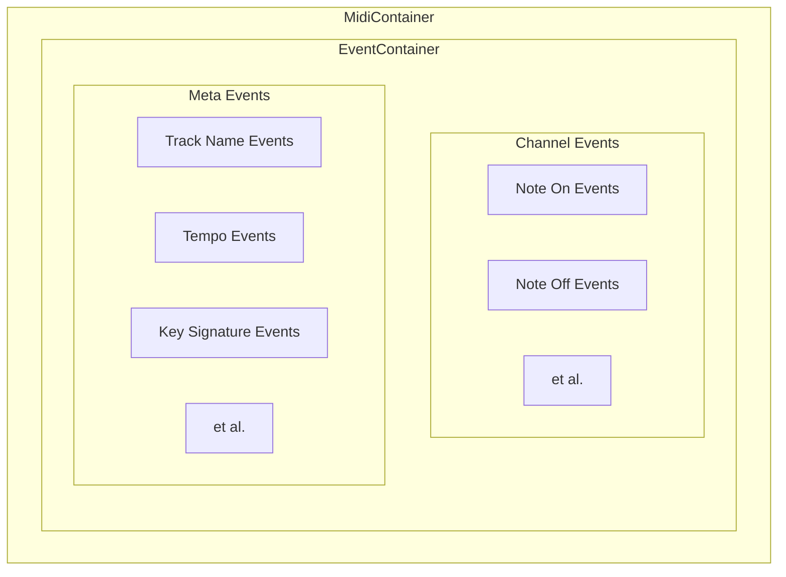
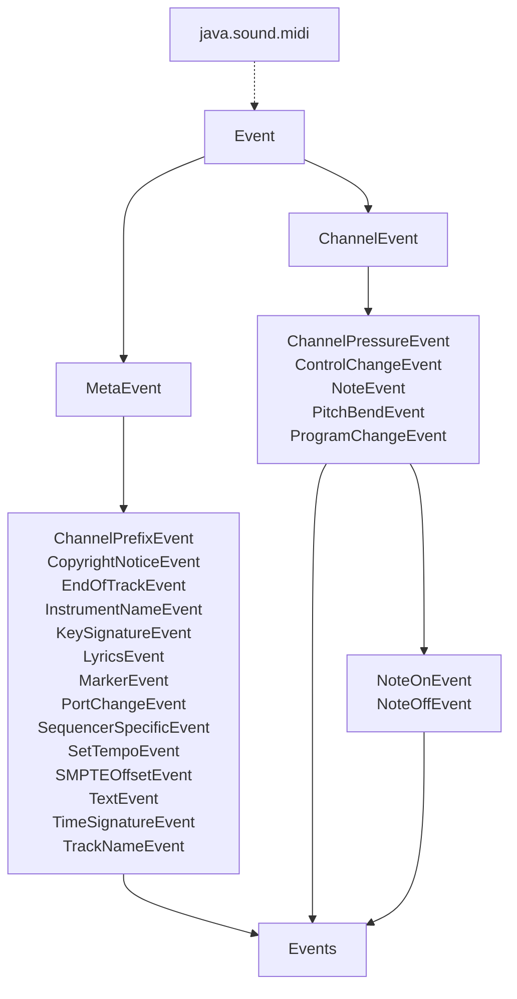

NOTE: this is now dated. Currently refactoring towards a vertical split package structure 
(musicxml, midi) rather than a horizontal one.

They each have 5 packages, even though some of the packages may be thin. This is due to the 
uneven complexity between formats in, say, exporting, while maintaining an identical/common 
package structure for navigability and cognitive load.

# Architecture & Package Structure

# Overview

`reductor` consists of a number of packages. The main package, `core`, representing the "domain" classes, is the core of the code base. It is largely a Domain-Driven Design (DDD).

Outside of the `core` package, are several data flow and program execution packages:

+ `app`: program runner, as well as container for program-wide data/classes
+ `io`: handles I/O of MusicXML and MIDI data
+ `parsing`: validates, sanitizes, and parses input MIDI/MusicXML files
+ `core`: internal domain models and algorithms
+ `dev`: development helpers, debugging, file catalog

# parsing

The main purpose of the parsing package is to convert raw MIDI/MusicXML data into objects. Invalid files, important high-level metadata, etc., is handled at this stage. In other words, it is at this stage that the MIDI file is validated -- though not necessarily the musical data within.

In the future, this class could be reduced and pared down. That being said, debugging and development would be nearly impossible (at least, for me) without the transformed data in this package.

Direct conversion to domain objects is a possibility, but for multiple reason I believe this to be suboptimal design-wise.

## midi

The main purpose of the `reductor.parsing.midi` package is to yield a `MidiContainer` object.

A `MidiContainer` consists of:
+ "Metadata" and some original `javax.sound.midi` library objects
+ `EventContainer`

An `EventContainer` is basically a sorting/dispatching, list-of-lists class that holds lists pertaining to the various useful categories of MIDI event needed for domain object construction:
+ Channel events: note on events, note off events, etc.
+ Meta events: tempo, key signature, and track name events, etc.

All the individual event objects are of type `Event`, an abstract parent class of `ChannelEvent` and `MetaEvent`, which each have a number of implementing classes. Additionally, `ChannelEvent` includes one more abstract class, `NoteEvent`, which has two implementing classes, `NoteOnEvent` and `NoteOffEvent`.

`Event` is essentially a beefed-up wrapper of the `javax.sound.midi` class `MidiEvent`.

## musicxml

The `reductor.parsing.musicxml` class is a planned extension (WIP).

# dataconverter

## midi

Once a valid `MidiContainer` is produced by `reductor.parsing`, it is passed to `reductor.dataconverter` to be converted to a domain object (a `Piece`).

Given the `MidiContainer` object and its data, the `dataconverter` package is responsible for:

1. Extracting
2. Validating
3. Sanitizing

This includes note event pairing, and quantization.

The output of the `dataconverter` package is a `Piece` object.

## musicxml

Same as `reductor.dataconverter.midi`, except for musicxml. 

However, this package is currently only capable of converting a `Piece` to a valid MusicXML file.

+ Import of MusicXML is a future extension (WIP).

Additionally, the export portion of the `musicxml` package consists of a series of nested builders (reflecting the XML hierarchy), whereas this is not necessary in the `midi` package.

# core

See: next document, [reductor.core](4-packages-and-arch.md).

# app

This package is underdeveloped and mostly an execution driver. It also contains file path constants.

# dev

Contains various classes helpful for development. Not meticulously maintained, mostly specific to my machine, and curated to match my workflow rather than best practice or good design.
