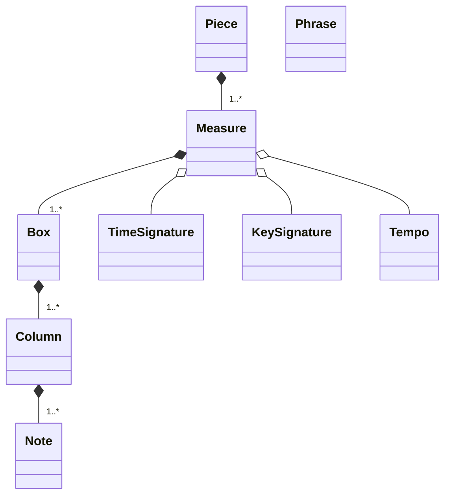
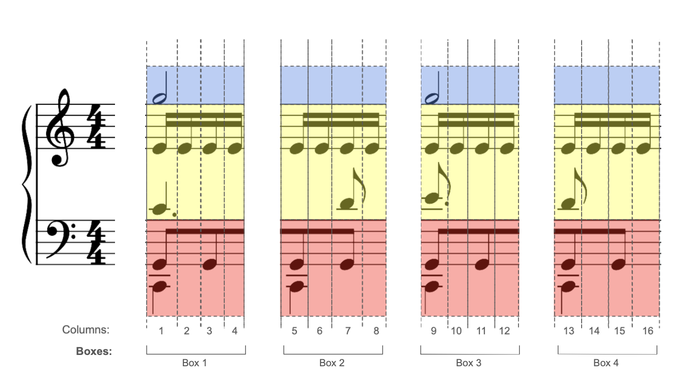
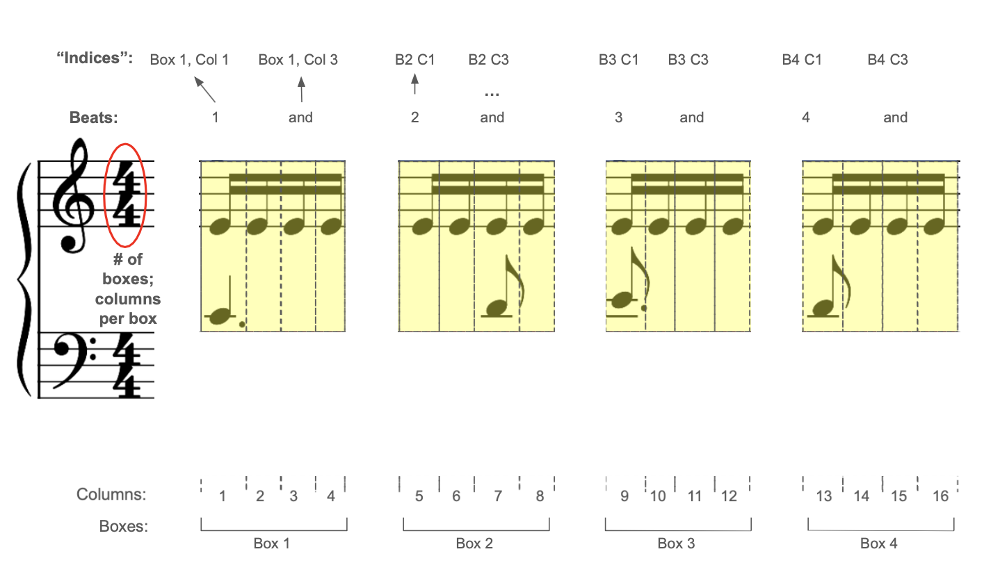

# Domain Classes

This document is a WIP as the project evolves. The more detailed documentation is in the Javadocs in the files themselves.

Everything is one package for now. Package and sub-package refactoring is planned for the future.

The
`reductor.core` package contains all the classes that define the domain/internal structures, functionality, and organization of the program.

MIDI/MusicXML data is transformed to these internal representations in other packages.

A `Piece` object (the root element/class) can be converted back to MIDI/MusicXML, and the data thus exported as a valid structured file.

# Summary

+ Primitives: `Rhythm`, `Range`, `Hand`, and the metadata classes
+ Metadata classes: `TimeSignature`, `KeySignature`, `Tempo`
+ Model classes: `Piece`, `Note`, `Measure`, `Column`, `Box`, `Phrase`
+ Data structures: `IntervalTree`, `Bucket`
    + A `Bucket` is an `ArrayList` wrapper, specialized to contain
      `Note` objects, and used in conjunction with the `Noted` interface
+ Interfaces: `Ranged`, `Noted`
+ Enums: `RhythmType`, `RhythmBases` `Hand`
+ Algorithms: `HandSplittingFunctions`, `ReductionFunctions`

The hierarchical structure is as follows:

+ Pieces contain...
+ Measures, which contain...
+ Boxes, which contain...
+ Columns, which contain...
+ Notes

Structures higher in the hierarchy can be parsed into any set of structures below it.

The metadata classes (primitives) are typically held by
`Measures`, since musically, that is where they most apply.

## How They Fit Together: Example

This is shown below for a single `Measure`; the coloring corresponds to left and right hands, and the middle region (blue, red, and yellow respectively):

+ `Box`:
    + __Horizontal__ analysis/manipulation of Notes in Columns - that is, left-to-right
    + Texture- (and pitch-) based analysis
    + A `Measure` is just a "special case" of a `Box` (not really class-wise, but theoretically)
    + Can "plug-in" further algorithms for hand-splitting ("Is there a lot of jumping around going on that would make certain Column-only hand-splitting decisions untenable?")
+ `Column`:
    + __Vertical__ analysis/manipulation of notes - that is, up-and-down
    + Exclusively pitch-based analysis
    + Triage first stop for hand-splitting and basic texture-thinning (removing doubled octaves, etc.)
+ `Note` (**leaf** element)

Theoretically, without actually filling or constructing objects and using only ranges, one could say "Get me the left hand notes of beat 3 of Measure 16" and it would just be a matter of:

+ Getting the Measure range (subdividing the Piece)
+ Getting the Box range (subdividing the Measure)
+ Getting the Column range (subdividing the Box and then splitting to get just the left hand notes)

So, a sort of "indexing" scheme now exists. (That is to say, everything has a determined location or set of "coordinates" within the entire composition represented by the original MIDI file). In the illustration below, just the middle region (not left or right hands) is shown in yellow:

Knowing *where* in a measure a certain Column or Note occurs is important for harmonic/rhymic aspects of reduction analysis. For example:

+ Pickup beats will be the last full Column of a measure
+ Analysis based on beat hierarchy (i.e., from strong to weak;  1 --> 3 --> 2 --> 4, in 4/4)