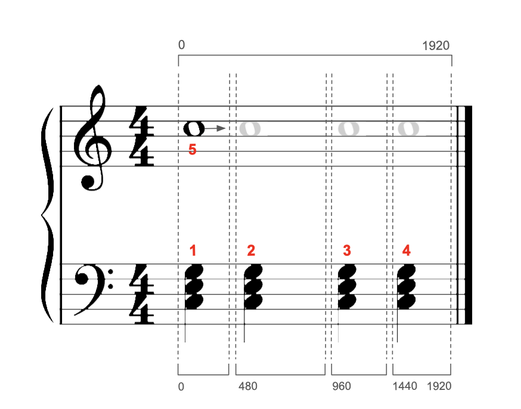
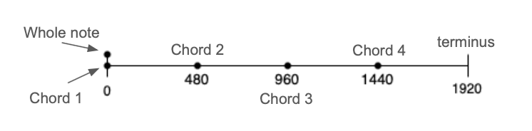
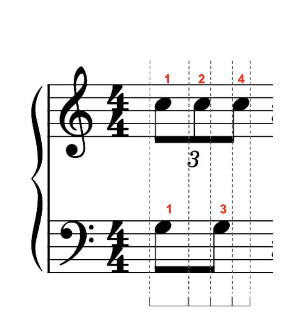

# Column

A Column represents the smallest unit of musical change, regardless of where it happens in the
staff, always extending vertically up and down (thus `Column`).

Basically:

1. Each time a new note occurs, a new Column should be created
2. A Column should know about notes that extend into it from the previous Column(s)
3. However, a Column should only ever manipulate notes that are native to it (i.e. not holdovers -- that would be a previous Column's job/responsibility)
4. A Column should contain all other notes "on" (i.e. a "vertical" segment) occurring in its range, but its range should never include notes with different start ticks. Again, if a new start tick occurs, that signals new Column creation.

The purpose of the Column is to compare, analyze, and manipulate notes by pitch. This is notable because everywhere else in the program, notes are compared by where they occur in time (horizontally), and not by pitch.

## Construction

This can be thought of in terms of a number line:

1. Put all note start ticks into a Set
2. Construct Ranges between all the start ticks, as well as a final "terminus" (e.g. last end tick of the last note, which is to be included)
3. Query the note tree with those Ranges and you have perfect Columns, even when syncopation is involved.

For instance:

+ We do NOT want a Column for each Note (we do NOT want 13 Columns)
+ We do NOT want 5 Columns
+ We want 4 Columns that all know about the whole note, but only the first Column "owns" the whole note
+ If, in Column 3, the RH is occupied, it can't come down and help with notes. But, Column 3 should NOT be making decisions about the whole note.

And here is what that measure looks like in terms of the number line:

Slightly more complex (syncopation):

+ Should have 4 Columns
+ If you pat this on the table, and count hands-together as once, you will notice that you pat 4 times. This is a perfect indicator of Column creation.

## Column Properties

Once a Column is filled with notes, it can decide if it is:

+ **Pure**: all notes within the Column have the exact same range (nothing extends into it from before; nothing extends past its range into the next Column, either)
    + These would be the easiest cases to reduce, as they are essentially self-contained units. Think the left and right hands both playing big quarter-note chords.
+ **Semi-pure**: notes may extend past the Column's range into the next Column, but all notes start within the Column (contains no holdovers)

During that process, it can assign `isHeld`, which is a context-based field of a
`Note` (still deciding if this is a good idea or not... might need to have a separate set of
`heldNotes` *within* Column to keep things better encapsulated).

It can split hands, using a default hand splitting function (the basic one).

It can also do some cool stuff like calculate the "split point" (the imaginary pitch exactly halfway between the thumbs), median/mean pitch (which can sort of shed light on what area of the keyboard the hands are occupying during that Column), etc.