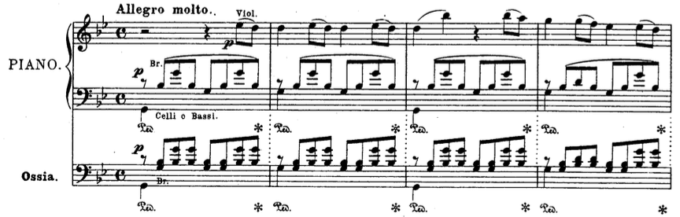
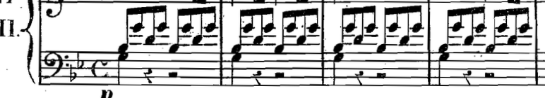
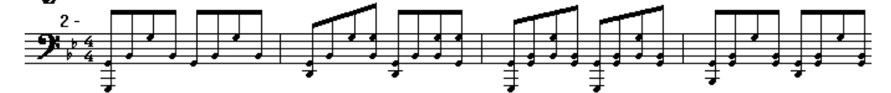
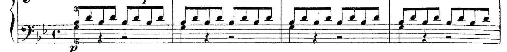
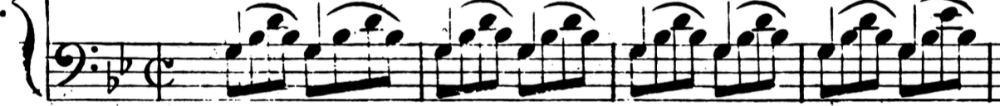

# Algorithm

Notes/sketches/questions specifically pertaining to the non-piano to piano reduction algorithm.

Also tries to establish some terminology that might make writing about this stuff easier here and later in documentation.

## Overview & Terminology

General:
+ Score: the whole thing
+ Reduction: used almost exclusively for non-piano to piano works; sometimes used interchangeably with transcription, but more literal/utilitarian than a transcription
+ Transcription: technically any instrument-to-other-instrument work, but mostly used in a piano context; sometimes used interchangebly with reduction, but little --> lot more editorializing usually

Polyphony stuff:
+ Voices: general term for discrete instruments/voices (i.e. choral) in a score
+ Voicing: it's own distinct term referring to the "positional" relationship of the same tones in a chord; usually in the context of hierarchy of important intervals within thicker chord
+ Spelling: defining chords in certain ways/inversions; e.g., a CM chord is "spelled" C-E-G

Algorithm stuff:
+ Aggregate: process of getting all notes at a given time represented as a single chord
+ Chord: chord
+ Chord-texture: vague term I am coming up with now to mean a bunch of tones spread over time and also there is a rhythm component to it; important for thinning decisions
+ Duplicate: the same tone, in the same register, in different voices
+ Doubling/tripling: the same tone, in different registers, in different voices
+ Thinning: this will be the bulk of the algorithms rules, and how it is done will vary
  + Subtractively: thinning out chords by removing duplicates, doubles, or triples, or prioritizing important voices at the expense of less important voices
  + Creatively: thinning out chords/textures using more liberal approaches (in relation to the source material), e.g., arpeggiation
+ Prioritization: when a choice has to be made somebody has got to go
+ Arpeggiation: spreading a single chord out over time (each note is played one at a time, over time); can be ascending, descending, or often just both
+ Tremolo/trill: split a chord any which way and those two pieces oscillate over time
+ Alberti bass: a very piano-specific term but it's a specific arpeggiation pattern named after a guy and 18th centruy keyboard music is littered with it; it's basically just low-high-mid-high pattern for a 3-piece chord, over and over again

## Example: Mozart Symphony No. 40 (i), mm. 1-4; LH

Here are a bunch of reductions (called so because they - for the most part - try to transcribe the orchestral score literally to piano) for a Mozart symphony (orchestral work) by a bunch of different guys who took different approaches to translating it to piano-ese.

Criteria is mostly subjective, but largely based around playability and how closely it mimics the original textures of the score. The first one is chosen as best because:
+ It mimics the texture of the score (in terms of voicing, i.e. 1-3-8) and not resorting to "comfier" (for the hand) reorganizations of the tones. 
+ It incorporates all voices (1 bass + 1 cello (duplicate) + 1 viola + 1 viola - playing divisi)
+ It thins out the texture of the divisi violi through arpeggiation

**Original orchestral score:**

+ Violas are divisi
+ Cellos+Basses are doubled up exactly

### Best:

+ The ossia (italian referring basically to "and here's the harder version if you're interested") passage is *nearly* (i.e. "too") literal, and all but unplayable (at tempo, for sane people)
+ The G is kept as a sustain note, therefore omitted
+ The 1-3-8 chord-texture is thinned out over over time (i.e. arpeggiated)

### Good:

+ I don't like the arpeggiation (not totally correct voicing of chord-texture) but rhythm and other stuff mostly well-represented (except bass jumps)

### Bad:

+ Truly a nightmare, this has and never will be performed by a human

The rest destroy the voicing of the chord-texture (resort to 1-3-5) and introduce lazy thinning techniques (e.g. tremolo in place of arpeggiation)

## Pieces that could make good spread of test cases

Selection criteria:
1. Stuff you know like the back of your hand (aurally)
2. Not too complex
  + Probably stick with pre-19th Century
3. Shorter
  + This just seems like a good idea...
4. Stuff which already has (high-quality) reductions available?

Roughly simplest to complicated-est (descending) per each category

1. **Orchestral** - nightmare
   + Haydn Oxford Symphony (i)
2. **Chamber** - nightmare but with less parts
   + Schubert Quartet 14 (ii)
3. **Choral** - SATB (+ orchestral), decently nightmarish
   + Bach Mass in b minor: Gloria: Qui sedes ad dexteram Patris (1 soloist (plus english horn??))
   + Pergolesi Stabat Mater: Quando corpus morietur (2 soloists)
   + Bach Mass in b minor: Domine deus (2 soloists)
4. **Soloist** - Concerto; Opera; Art songs; Instrumental sonatas
   + Mozart Clarinet Concerto (ii)

## Rules

1. Exact duplicates --> keep 1
2. Octave duplicates --> keep < 5 if LH range < 8 && RH range < 8
3. Repeated notes like EEGGEEGG are not fun on piano and should be EGEGEGEG if possible
4. Deciding between tremolo and arpeggiation
5. Divisi separation
6. Register prioritization
7. Interval prioritization
