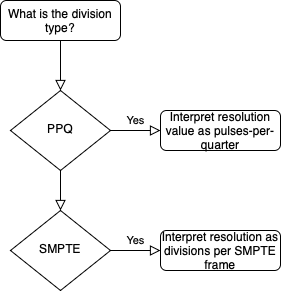
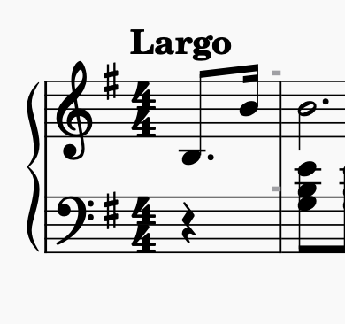
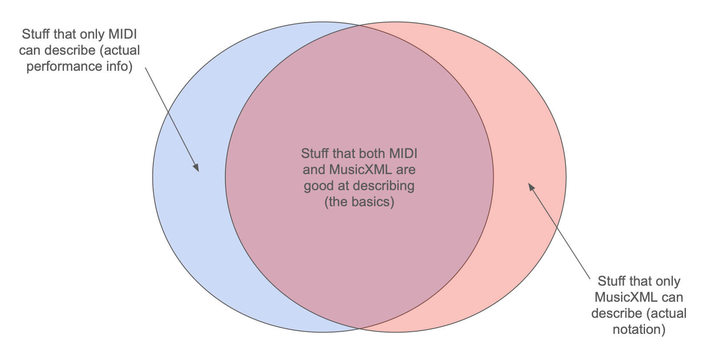
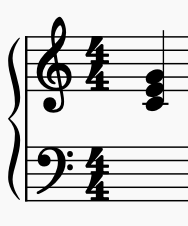
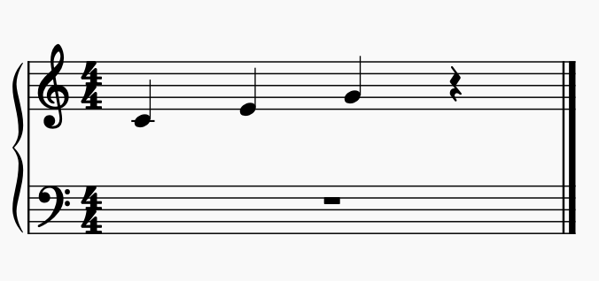
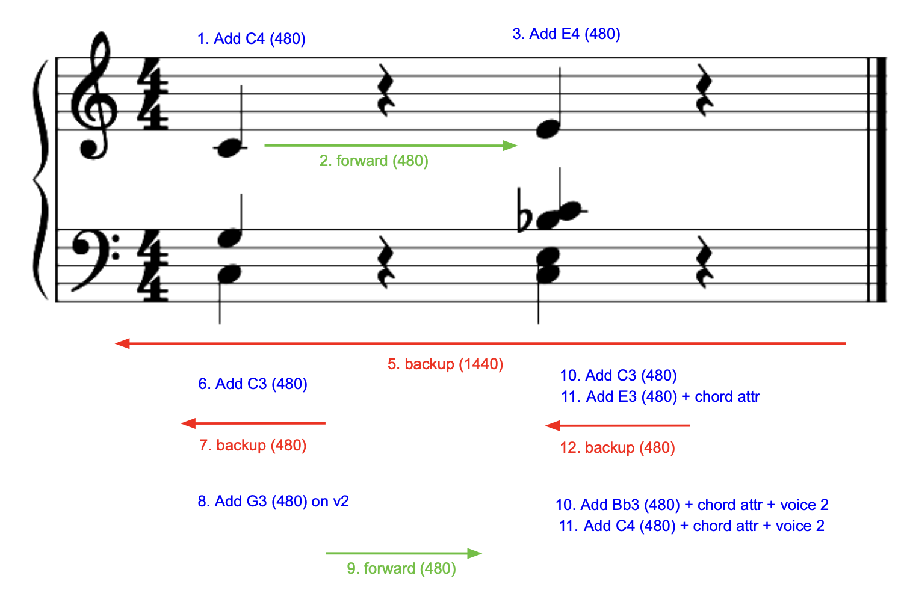
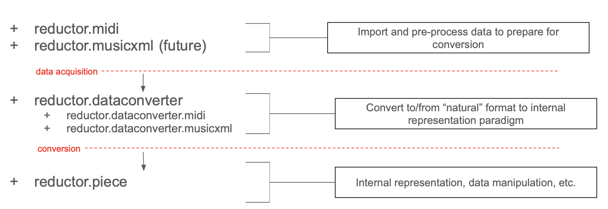
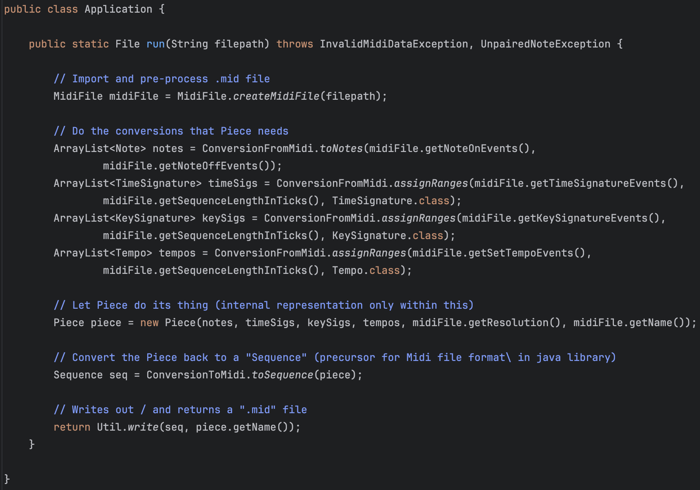
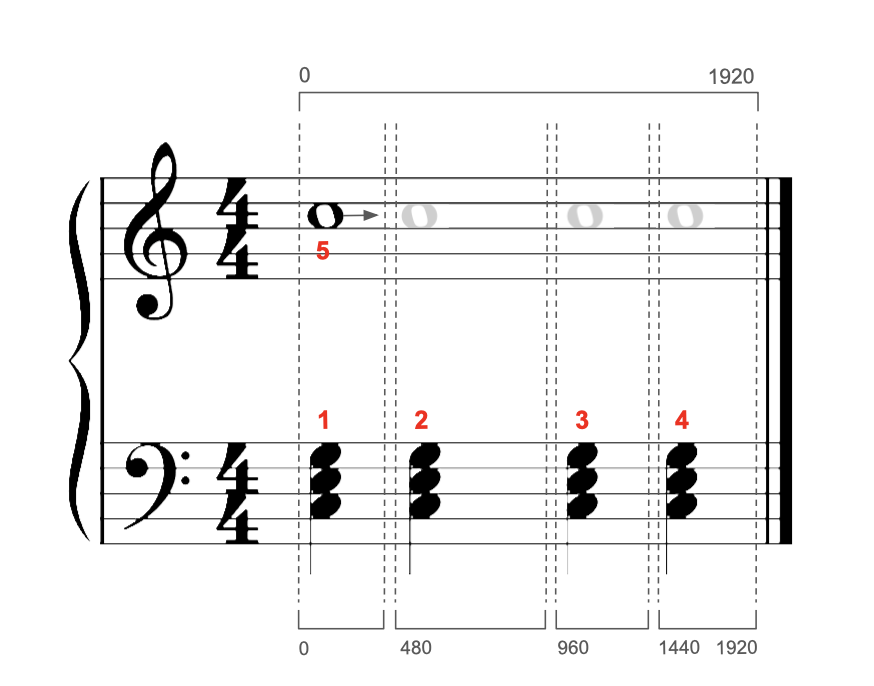
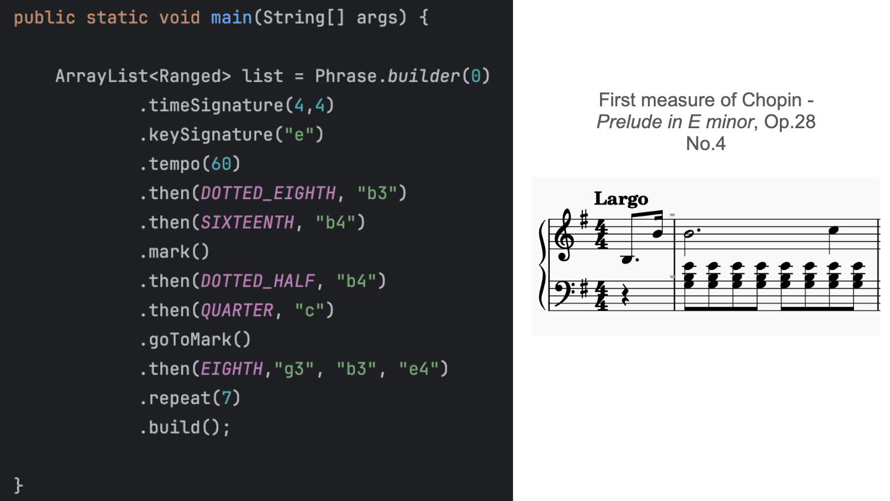

# Capstone: Final Report

The internal representation stuff starts [here](#reductorpiece).

If anything, you should definitely check out [Appendix B](#appendix-b-cool-reductions) for some cool YouTube/Spotify links. I think they're pretty cool.

## MIDI

### Protocols

The MIDI standard is divided into two protocols.

**SMF (Standard MIDI File) protocol**: how performance data is organized, arranged, and stored in a static file
+ Includes a **header** with very important metadata; after that is any number of MIDI events
+ Most MIDI files further arrange their non-header events into **tracks**. This is simply an abstraction/grouping that is helpful in various contexts (e.g. GUIs), but has no real control over anything (I hardly did anything with them in my program except get Strings pertaining to instrument names, which are only reliable/present in half the MIDI files I found anyway)
  + A single-track could have information for 16 different channels (the actually important part distinguishing and grouping different instruments or parts)
  + Conversely, an SMF with information pertaining to 1 channel could spread that data over 16 tracks and it wouldn't make a bit of difference on what comes out of any speakers

**Wire protocol**: how execution data is to be created and sent over the wire by MIDI-capable instruments, devices, and computers.

My program deals exclusively in the SMF domain.

### Events

The fundamental unit of MIDI data is the MIDI **event**, which consists of:
+ A timestamp of sorts known as a **tick** (a single integer)
  + These are *relative*, and also known as delta times
  + However, the `javax.sound.midi` library does the developer a huge favor by converting all the ticks to absolute ones
+ A message (the actual data), which comes in a wide variety

MIDI messages fall into 3 categories:
+ **Channel** (also called **voice**) **messages**: note and controller stuff (the actual *sound* part)
+ **Meta messages**: metadata stuff (time signatures, key signatures, tempo, track name, etc.)
+ **Sysex messages**: real-time messages concerning the control of devices/instruments (akin to keyboard/mouse events, except with contorller sliders, pedals, etc.)

Meta messages have nothing to with how data sounds in real-time, so it is never sent across the wire. Conversely, sysex messages have nothing to do with a static representation of the data, as they are real-time messages, so they are never stored in an SMF.

<!--  -->
<div align="center">
    
</div>


### Division Types

The **division type** is very important and dictates how an associated value, the **resolution**, is to be interpreted by sequencing software. There are two:
+ **Pulses-Per-Quarter (PPQ)** or Ticks-Per-Quarter (TPQ) or Ticks-Per-Quarter-Note (TPQN) **timing**
  + If the division type is PPQ, the resolution value defines how many ticks constitute a quarter note
  + I tend towards ticks-per-quarter, as the word "pulse" may make sense in terms of MIDI beat clock stuff, but is slightly confusing in a normal music context, where "pulse" usually refers to the tempo or meter, and not any kind of subdivisions or a rhythm
+ **Society of Motion Picture and Television Engineers (SMPTE) timing**
  + If the division type is SMPTE, the resolution value defines how many divisions per SMPTE frame (did not delve into this)

<!--  -->
<div align="center">
    
</div>

Regarding my program, I decided not to support SMPTE timing on two painstakingly and carefully considered criteria:
+ It's really rare, especially for my use cases (amateur musicians notating, deriving, and posting MIDI files)
+ It's hard

### Resolution

The resolution is extremely important as it essentially defines every note duration for an entire MIDI file.

Different MIDI files have different resolutions, but the conventional default is 480, meaning *a quarter note lasts for 480 ticks*. You can then derive every other rhythm value from that number, meaning if you get a 240, it's an 8th note; if you get a 960, its a half note; etc.
+ The **tick** is just an abstraction of the microsecond. That is to say, each tick has an exact conversion to microseconds. You could have a resolution of 500,000, but it would be a nightmare to handle for anybody working with the data, especially for long pieces. There's just no need to have that much wiggle room between rhythm values. The other end of the spectrum, however, is too low of resolutions. Less freedom means more robotic and rigid-sounding playback. So, in general, the higher the resolution, the more expressive and subtle timing differences (in a recording of a performance or in manipulation in a DAW) can be represented. 
+ A resolution of 480 translates exactly to 500,000 microseconds per quarter note.

There are some additional considerations.

First, the resolution sets a lower bound of sorts on the smallest rhythm you can have before resorting to fractional ticks. I will illustrate with scaled-down numbers:

    24 ticks == quarter note
    12 ticks == 8th note
    6 ticks == 16th note
    3 ticks == 32nd note
    1.5 ticks == ?

The thing is, there *are* no fractional ticks in MIDI. The decision to round up/down is left up to notation or sequencing software.

Now, we are talking about differences that would be imperceptible to the human ear. The bigger problem is how those small rounding corrections accumulate over time, leading to something called **time drift**. In the above example, the effect is greatly augmented due to the scale, but it would only take 3 rounding corrections to be off by an entire 32nd note! 

TL;DR: the bare minimum resolution should at least make it so the smallest rhythm within a piece has a duration that can be represented as an integer.

The 120-960 range seems to be the sweet spot (they are what I have seen the most). The default 480 is not *amazingly* fine-grained, and not super coarse.

I have not seen anything higher than a 960, but I have seen a 48. It was a small Bach chorale where there were only two rhythms: quarters and 8ths.

### Quantization

MIDI was designed, and is still best, for transmitting and storing exact details of a real-time performance.

For example:
+ The exact velocity (i.e. volume) of a key being pressed --> some integer between 0 and 127
+ The exact time a key was pressed --> some integer as a delta time from the last event
+ The exact time a key was released --> some integer as a delta time from the last event

If a quarter note is defined as 480 ticks, a performer will release a key *approximately* 480 ticks after they pressed it - say 478, 483, or some other close value.

The problem: MIDI was never meant to translate perfectly to notation on a musical score. Part of the reason quantization in MIDI exists is to force imperfectly-executed performances (i.e. *every* human performance) into a cleaner grid. Another way to think about this is taking sloppily executed notes and notating what they *should have been*.

Say notation software gets a note whose length is 171 ticks:
+ We will define a quarter note as 480 ticks
+ The example note is close to 180 --> the exact length of a dotted 16th note
+ The example note is *also* close to 160 --> the exact length of a triplet 8th note

The is a relatively simple example. You may read it and think, "It is closer to 180 - clearly the performer was executing a dotted 16th" or "All you need to do is round to the nearest pre-defined rhythm value." I will speak more on this later in the implementation section below.

It should be noted that this is mostly a notation issue. A tick difference of 9 is imperceptible to the ear, and, furthermore, context helps listening to playback a lot more (e.g. hearing groupings or sequences of notes.) (This is also somewhat dependent on the tempo and resolution).

However, on paper, a dotted 16th and triplet 8th is a big difference in the way those two rhythms are usually used.

A second issue regarding messy tick values: notation programs are free to implement start/stop ticks however they want. The MIDI standard does not specify any sort of rule, for obvious reasons - think legato, overlapping effects, etc. 

My blood froze 3 weeks before the end of the semester when I started encountering MIDI files where the previous note's stop tick  perfectly overlapped the current note's start tick. MuseScore encodes its start/stop ticks by sending an OFF 1 tick before the next ON.

Notation Program A encodes all its notes with start *and* stop ticks on the grid:

    0 ON, 480 OFF
          480 ON, 960 OFF
                  960 ON, ... 

Notation Program B encodes all its notes where only the start of each note is on the grid (and the off is -1 before the next note)

    0 ON, 479 OFF
          480 ON, 959 OFF
                  960 ON, ... 

Of course that 1-tick-length silence is 100% imperceptible to the human ear in most reasonable contexts.

However, this essentially broke my program, since all rhythmic ranges in my program are encoded as half-open (relative to their full duration). In many of the range-constructing/deriving functionalities in various parts of the program, I was getting invalid interval exceptions for stuff like `[480,480]` or `[481,480]`.

To summarize, it was the that last issue (the half-open vs. inclusive range issue) that prompted the quantizing functionality at the last minute.

#### Workarounds

First, I looked for libraries with quantization functionality. 

There were a couple options, but none of them looked easy enough to integrate with my program. 

In fact, the best matches ("I give you a range, you quantize it"), were not in Java, and with my time-crunch, I chose the lesser of two evils:
+ Learn (for the first time) how to write JNI stuff for a C++ quantization library
+ Implement my own (even if simplified and not the most robust)

I chose the latter.

#### Implementation

To implement this, you could go the route of having some map of determined rhythm values, and some heuristic/algorithmic approaches to determining acceptable threshold or MOE values when mapping incoming note lengths to what they "probably" are. 

This works well most of the time. But good MIDI-handling software (let alone something like professional notation software) has to be able to support (nearly) any type of rhythm a user can conjure up. This means your quantization map may need to account for a quintuplet-dotted-64th note.

The problem you run into is that a lot of the pre-determined note values start getting close enough in range that they either start to overlap, or screw up the MOE calculations. You could adjust the MOE to be logarithmic or something, so that it too adjusts based on the initial length of the note, but you can't fully escape the principle of: the more granular the rhythms you want to support (no matter how exotic are frequently seen in practice), the more your accuracy *can* suffer.

Even in professional software: you can get a wacky MIDI file, and click quantize (even with various granularity options), and it will result in an almost equally wacky quantization result.

Furthermore, there is no way to tell if the performer was simply executing a rhythm with a *truncating or extending articulation* (staccato or legato, respectively). This just adds yet another "impossible-to-perfect" element to quantization implementation. 

(The *actual* lesson here is, again, that MIDI was never really meant to be notated - a theme that will be visited several times in this report).

My quantization function, which seems to work for most of the basic rhythm values (although not vigorously tested as it was a late addition to the program), started out as around 300 lines of code, and intended to preserve the in- (original) resolution. 

When I realized that even MuseScore basically just converts every MIDI it exports to a resolution of 480, I decided to just scale everything to 480 myself, and stop caring about the in-resolution.

That simplified a lot of the code, and, in the end, I ended up with one pretty small function. (I also did away with some unnecessary transformations. I discovered they were unnecessary with some intense and formal mathematical proofs, and definitely *NOT* by dumb luck during trial-and-error.)

The code below is slightly changed from the actual code for illustration purposes (e.g. the Range class is actually immutable and doesn't have setters as shown below, but the concept is the same; some -1 corrections for half-open/inclusivity):

```java
public static Range quantize(Range inRange, int inResolution) {

    /*
    Philosophically, this should be a double. In MIDI, it really won't make a difference 
    and will prevent some heartache and unnecessary coddling of data types and fractional 
    amounts that will get thrown away in the end, anyway.
    */
    long scale = 480 / inResolution;
    Range scaledRange = new Range(inRange.low * scale, inRange.high * scale);

    /*	
    This is an enum value that includes various fields about a rhythm, e.g.:
      + `r_8in3` (triplet 8th)
      + `r_4` (quarter)
      + `r_16dot` (dotted 16th)
    There are some heuristic techniques in the .fromRange() method that attempt 
    to assign ambiguous inputs.
    */
    Rhythm rhythm = Rhythm.fromRange(scaledRange);

    /*
    This is the essential formula for finding what a rhythm should be when quantizing.

    `rhythm.base` is a constant (based in 480 resolution) and is one of: 
        + whole (1920), half (960), quarter (480)... 128th (15)

    `rhythm.divisor` is if the rhythm grouping (a triplet 8th would have divisor 3; normal would be 1).
    
    */
    double gridWindowSize = rhythm.base / rhythm.divisor;

    /* Now we have a grid window that is the "perfect" duration for a given rhythm. We'll just start it at 0. */
    Range gridWindow = new Range(0, gridWindowSize);
    
    /*
    "Ratchet" the grid window up to where it's supposed to be. 
    This (using an arbitrary tolerance) worked best when considering that you didn't know if you were catching the head-end of a poorly executed target note, or the tail-end of the previous note.
    You want to find the one you are *supposed* to (near-fully) overlap.
    */
    final long TOLERANCE = 4;
    while (gridWindow.overlappingRegion(range) < TOLERANCE) {
        scaledRange.shift(gridWindowSize);
    }
    
    /* To "snap": */
    long quantizedLow = gridWindow.low();
    long quantizedHigh = quantizedLow + rhythm.duration;
    
    return new Range(quantizedLow, quantizedHigh);
}
```

In unit tests, I used a bunch of helpers to test things en masse. I used the logarithm thing I mentioned earlier to create random offsets:
+ This is because the length of the rhythm and the MOE shouldn't have a linear relationship. Even with larger rhythm values like a quarter, you're not going to have someone (unless they've had one too many while performing at open-mic night) executing a quarter note with a 75 tick MOE. 

I basically have an ArrayList I fill with +/- `someOffset` (calculated as log of rhythm duration), and then use Math.Random to get me an index to pull out one of the offsets. 

So, for a perfect quarter note (`[480,960]`), that helper might pop out something like `[478,964]`. 

### Notating MIDI

MusicXML (which I will go into later) is sort of a response to the shortcomings of MIDI in terms of notation.

MIDI was developed during a time when GUIs and displays could not accommodate advanced music notation. It was never intended to be something that stored/transmitted detailed notation information, but rather, was intended to be a protocol for digital instruments to communicate with each other, and computers.

In the early 2000s, MusicXML was developed by a W3C subgroup (which is still in charge of its standard today) as early notation programs (like Finale) and GUIs that allowed plopping notes onto a staff with the mouse started coming out.
+ Fun fact: Finale, an industry standard for the last 20+ years announced it was ceasing production the first week of this project/semester. I used to use it all the time during my undergrad in the music technology lab.
+ Other prominent notation software includes Sibelius, Dorico (both pricey, professional-grade), and MuseScore (FOSS, and very good; purportedly the most widely-used in the world).
  + Still mad nobody from their team helped me with my forum post a month ago. Makes it impossible to open MuseScore from my program using `ProcessBuilder` *and* is a pain when opening associated files without instance of MuseScore already running.

Some of the metadata that MIDI *does* include that can be helpful for notation:
+ Time signature events
+ Key signature events
+ Tempo events

For instance, MIDI data can be parsed and used to display everything seen here:

<!--  -->
<div align="center">
    
</div>

The thing is, however, that *how much* metadata a MIDI file includes usually correlates to whether it was "recorded" (by somebody playing a keyboard) or notated (somebody went in and manually made a score in notation software and exported the MIDI). Even then, not all authors of notated scores meticulously notate all the metadata-related things like tempo. I have opened up MIDI files of "Symphony X in Bb minor" only to find there is no key signature data and the spelling of notes is wild.

My program does not even attempt to parse files without time signature data, since it is crucial to the creation of Measure constructs.

#### Time Signature Events

There is no way to calculate *anything* regarding measures without time signature events. Thankfully, if the author of the MIDI file notated things accurately, time signature events will probably exist *and* be placed correctly within the score.

If you have the time signature, and the value of a quarter note (which you have because you have the resolution), you can calculate measure size.

It just involves getting a common denominator (i.e. the lower numeral of the time signature) of `4`, to correspond to quarter notes; then, you just multiply the number of quarter notes per measure (i.e. the upper numeral) to get the size of the measure in ticks:

Like with the previous (and following) code examples, I took out non-recipe stuff (e.g. error-handling/assertions):

```java
public static long calculateMeasureSize(int upperNumeral, int lowerNumeral) {

	// These need to be floats for stuff like 3/8 or 7/8
	float upper = (float) upperNumeral;
	float lower = (float) lowerNumeral;

	// Get lower numeral to be in terms of quarter notes (which would be a lower numeral of 4)
	while (lower != 4) {

		if (lower > 4) {
			// e.g. 3/8 --> 1.5/4
			upper /= 2;
			lower /= 2;
		} else if (lower < 4) {
			// e.g. 2/2 --> 4/4
			upper *= 2;
			lower *= 2;
		}

	}

	// Quarters per measure * ticks per quarter
	float measureInTicks = upper * Piece.resolution;

	return (long) measureInTicks;
}
```

In the score image earlier, there is a pickup measure. I spent a long time writing an algorithm (turned out to be pointless) to "detect" the presence of a pickup measure:
+ Put all the time signature events into a stack; calculate and fill a container with measures; if the last measure created is shorter than the last time signature popped, it is probably a pickup
+ If the first note happens after a sizeable amount of rest, it probably occurs in a pickup measure

Turns out notation software (generalizing to really mean MuseScore) will encode pickup measures as a discrete time signature, with an identical lower numeral but smaller upper numeral.
+ For example, the snippet displayed above outputs as *two* time signature events: 1 measure of 1/4, followed by a measure(s) in 4/4.

I did not find this out until after the fact (I was completely done implementing and testing, and tried things out with an actual MuseScore file). I'm sure there is some sort of lesson to be learned here.

Thankfully, the "near-full measure of rest with a pickup note" case was salvageable and still applicable, and is shown later when discussing [Measures](#measures).

#### Key Signature Events

Key signature events are pretty pointless in terms of my program, as far as aiding harmonic analysis goes (e.g. "What is the root of this chord?"; "What key area are we in in this measure?") because even in music, key signatures don't indicate anything except the possible key area of the first and last measure (even then, though, there are lots of counterexamples).

It does make displaying written-out files nice, aids a *bit* in spelling pitches, and is helpful for the MusicXML stuff later.

#### Tempo Events

Tempo events are also kind of pointless in my program, except I handle and include them because it became really nice to control the playback speed of the MIDI files I outputted without having to put them into notation software and manually doing it.

The thing with tempo events is that they need to be increased/decreased by a scale, rather than literally, because there may be many tempo events in a MIDI file. 

Additionally, depending on the notation software, tempo events may be used to sort of "frankenstein" together a ritardando, fermata, or any other time diminution/augmentation expression.

This could come in handy for reduction stuff ("How fast are things moving here, and will the hand have time to jump down?"). However, the larger problem is their reliability - the author may note have included tempo directions, or included incomplete tempo directions (e.g. no bpm markings).

## MusicXML

As explained earlier, MIDI really was never intended for storing/transmitting score or notation details. It is for performance details, which can vary from the score due to:
+ Artistic interpretation
+ Imperfect execution

But, if you play back a MusicXML-turned-MIDI recording, it will sound much more robotic than a MIDI performance because it is interpreting the score literally:
+ However, MusicXML and notation software are getting better at producing pretty decent-sounding MIDI based on the score. Additionally, they are providing more options to authors to meticulously control playback through score indications and various configurations. 

So both MIDI and MusicXML, while both being able to do a lot of the basic stuff pretty similarly, each have their domains where they do what they do best:

<!--  -->
<div align="center">
    
</div>

I knew that at some point, my program would have to start dealing in MusicXML, since the whole point of the program is to produce scores. Additionally, having exact control of which hand was notated on which staff (upper or lower) in a piano grand staff is paramount to the purpose of the program, and MIDI doesn't provide any way to control this. 
+ The notation software I had experience with (MuseScore and GarageBand - which isn't notation software per se but includes most of the functionality needed to display MIDI as a score) use a pretty bare-bones approach to assigning hands: notes above and including middle C go on the upper staff, and the rest go on the lower staff.

So, while MIDI means my program can take input from a way wider array of files, *and* provided the basis for nearly everything in my internal representation, I knew I needed to confront the MusicXML stuff.

### A MusicXML Document (Background Info)

MusicXML is, being XML, hierarchical rather than serial.

The hierarchy is as follows:

                    
    ScorePartwise     <-- root element
                      _  
      Metadata 1       |
      Metadata 2       |---- score "header"
      ...              |
      Part-List       _|

      Part 1          
        Measure 1     
          Note
          Note
          Note
          ...
        Measure 2
          ...
        Measure 3
          ...
      Part 2
        ...
      Part 3
        ...
      ...
     /ScorePartwise

ScorePartwise is the root element. 
+ There is one other "species" of root element, called ScoreMeasurewise. It basically reverses the parent-child relationship between parts and measures (i.e. Measures contain Parts, and measures are added one at a time but contain all parts for that measure). It is rarely used.

The stuff preceding (i.e. everything other than) the various Parts is known as the **score header**. Score headers have 1 mandatory element (the Part-List), and various optional metadata, like "work" info, credits, encoding software name and info, etc..

The Part-List is essentially a map that contains ScorePart elements - each containing metadata and info about an individual Part element (like instrument name, number of staves, etc.). So each Part has a corresponding ScorePart in the Part-List.

My program, producing piano scores, means that we will just be talking in terms of 1 Part, with 2 staves (declared in the ScorePart).

### Timing

MusicXML essentially follows the MIDI quarter-note resolution timing paradigm in that everything time-related is based on the value of a quarter note. Instead of resolution, it is just called **divisions** (i.e. subdivisions per quarter note).

Most MusicXML files I came across had, vis-a-vis MIDI resolutions, small values. Instead of 480, 960, etc., I saw a lot of 24, 48, and 96. At first glance I thought "Ok, they are just lowering the granularity by dividing everything by 10." There might be more to this, but I didn't have time to look too deeply into it, and I decided to just use the MIDI resolution as the divisions value. It doesn't seem to have any negative affect, and works fine. 

So, the MusicXML divisions for all the files I output is 480.

### Note Placement

A lot of MusicXML stuff is pretty straightforward, except the placement of notes is pretty tricky.

Consider the first measure of the [C minor prelude of Chopin](https://www.youtube.com/watch?v=XeX4X_1_lo0):

<!--  -->
<div align="center">
    
</div>

You will notice that in the *3rd beat of the right hand*, there are 2 independent voices: the quarter "base", and the moving line (in thirds) in the melody/soprano.

If you think about this in terms of finger placement:
+ The G and B would be held by fingers 1 and 2
+ The melody would be played by fingers 4 and 5 (for both)

So, and including the left hand, we essentially have three "regions" of notes occurring at exactly the same time, but on disparate stems:

<!--  -->
<div align="center">
    
</div>

In MusicXML, notes are placed sequentially. At first glance, this sounds like it is essentially the same as MIDI. TLDR: it's not.

In MIDI, if I wanted to encode a C major triad in quarter notes with a resolution of 480:

    0: C4 ON --> 480: C4 OFF --> 0: E4 ON --> 480: E4 OFF --> 0: G4 ON --> 480: G4 OFF

and it would look like this:



It is all sequential, and it is up to the sequencing software to take that "flat map" and put everybody in their corrals and send them off at the right time during playback.

If you were to encode that *same* triad in MusicXML using the MIDI paradigm, it would like like this:



Where each note looks something like this:

```xml
<note>
    <pitch>
        <step>C</step>
        <octave>4</octave>
    </pitch>
    <duration>480</duration>
    <voice>1</voice>
    <type>quarter</type>
    <staff>1</staff>
</note>
```

In MusicXML, pitches don't mean anything to following notes with the same pitch: each note looks like a note to each other, so each note effectively "pushes" the following notes forward by its own duration.

MusicXML has a really easy fix to this: if something is a bona fide chord (i.e. all the noteheads are attached to the same stem), you simply prepend a chord (an empty element) tag top subsequent applicable note elements:

```xml
  <note>
      <!-- prepend chord -->
      <chord/>
      <pitch>
          <step>C</step>
  <!-- ... -->
```

But how does one place noteheads (i.e. notes) that occur at the same time as other notes but are *not* attached to the same stem?

Essentially, each time you want to place notes within the same time range (on the grid) that *don't* have connected stems, you have to add a `<backup>how_many_divisions</backup>` element to get the "counter" back to where you wanted to place something.
+ It can be helpful to think about all this stuff in terms of a counter or cursor keeping track of where you are in the measure at any given time.

A couple things to add before summarizing the whole process (which will probably be clearest): if you want gaps between notes, you need to add a `<forward>` element. It works exactly like the backup element, but progresses the cursor forward.

Finally, the left hand in a measure is usually "reached" by first filling in the whole right hand, and then backing up to the beginning of the measure (which requires you know who far forward you are), and starting over. As left and right hand notes usually don't share stems, this is a sensible way to do things. You could fill in beat-wise for *both* hands, but it would be unnecessarily complex.

In summary, and using a slightly simpler example than the Chopin:



And the pseudocode:
+ For just one hand
+ `next` and `curr` represent notes
+ `.start` and `.stop` refer to ticks

    // For rests (skip ahead)
    if curr.stop < next.start:
      forward = next.start - curr.stop
      list.add(forward)

    // For notes starting at the same time
    if next.start == curr.start && next.stop == curr.stop

      // They are to be attached to the same stem
      if next.stop == curr.stop:
        list.add(chord);

      // They are part of a different voice
      else:
        backup = curr.length
        list.add(backup);
        bumpVoice();	

There are more nitty-gritty things and edge cases, and the logic is rather lengthy. I'm sure it could be simplified, but the note placement stuff constitutes by far the largest share of MusicXML conversion logic.

Finally: notes that are tied over the barline are an absolute pain, but I won't go into that here.

### On the External Library I Used

For the marshaling/unmarshaling stuff, I used the [proxymusic](https://github.com/Audiveris/proxymusic?tab=readme-ov-file) library from the [Audiveris](https://github.com/Audiveris/audiveris) project. 

(I didn't have time to look too deeply into it, but I am actually looking forward to looking into Audiveris as a whole. It is OMR (Optical Music Recognition) software. Again, haven't looked too deeply into it, but... apparently can notate - using MuseScore, I believe - based off of an image/pdf!)

The library is good, but: there is ZERO documentation (except for a small and pretty uninformative unit test).

Thankfully, most of the code is just getters and setters.

So, process-wise, I basically went through the W3C/MusicXML documentation (which has a tutorial), and then used their [reference](https://www.w3.org/2021/06/musicxml40/musicxml-reference/elements/) page to look up cases as I came across them. 

Then, I literally just used `cmd+f` to look for possibly related functionality in the `proxymusic` library.

There were some surprises (and some unintuitive stuff that took me a while to figure out) but on the whole, it was merely tedious, and I got the pattern down eventually.

I am nearly done with the MusicXML package of my program (at least the writing-out portion). The only thing that remains is the note placement nastiness I mentioned above. Each time I fix one thing, and a new case presents the need for more unique handling. Then the code gets so busy with case-handling that I re-design... rinse and repeat. But it's almost there.

However (not to toot my own horn), the conversion to musicxml process was made even *remotely* possible because I had already implemented a bunch of the stuff it needed in my internal representation - the most useful being Measures, which hold time signature, key signature, and note data. I had also already implemented (the default/basic) hand-splitting stuff, so staff assignment was helped there too.

However, I definitely was missing some things - mostly related to pitch stuff. This is probably because I had written the program based on MIDI for 3.5 months, and in MIDI, pitches are literally just 0-127 values. Any of the stuff in my program to extract register, semitone, string-parsing, etc., was to make *my* life easier, and isn't the most robust. Some of it didn't align perfectly with how MusicXML does things (especially regarding enharmonic spelling, which my program doesn't handle, partly because my program does not have key-area-analysis capabilities, and that is a big determinant of spelling).

## Package/Program Structure

reductor is split thusly:



Additionally there is a `reductor.util` that handles:
+ File I/O stuff
+ Playback using `javax.sound.midi` methods (easier than opening another application, as it was usually just confirm a file sounds correct in the first 3 seconds)
+ Opening with various applications using `ProcessBuilder`
+ A class called `MidiDebugging` that just has a bunch of printing utility functions to look at MIDI bytes in various ways (was actually very helpful).

### Application

The `Application` class was a late addition to the program. It won't be final, either. It was called `DevelopmentHelper` for a long time. It is just to coordinate package duties in one, single program flow. It takes a String filepath, and pops out either a MIDI or (eventually) MusicXML file.

I include it here for the sole reason that it is a good illustration of how the program is intended to flow as a whole at the topmost level, and show how the different packages are kept separate and interface with each other:



## reductor.midi

The purpose of this package is to get MIDI data in a form that the `reductor.dataconversion` classes expect.

In the future, it will probably become part of a sub-package that it shares with a sister musicxml-importing-related package (similar in the way that the `dataconversion` package is bifurcated) that focus on the just data acquisition aspects of the program.

The general outline of major classes is as follows:
+ `MidiFile`: top-level things about a MIDI file, including a `File`, `Sequence`, and `Events` member
+ `Events`: a "list" class (just contains a bunch of lists)
  + In charge of sorting, typing, and creating all the `Event` instances
+ `EventType`: an enum used to support the `Event` hierarchy
+ `Event<T extends MidiMessage>`: an abstract wrapper class
  + `MetaEvent extends Event<MetaMessage>` and `ChannelEvent extends Event<ShortMessage>` are the major subclasses
  + Members include `MidiEvent event`, `T message`, `long tick`, and `EventType type`

The biggest impetus for the Event hierarchy was literally to override `toString()` in all of the child classes because it made debugging *and* simply learning MIDI 10x easier. A nice side-effect was that all the complex MIDI-to-English conversion stuff (undoing the MIDI encoding scheme) ended up being lifted and placed into the `dataconversion` package almost wholesale.

### Aside: The Java MIDI Library

I hesitate to call the `javax.sound.midi` library "feature-poor", because I have gone through the documentation and I believe it does exactly what it intends to do. It isn't intended to be a full-fledged "composing with MIDI" library (which other libraries like Python's `mido` seem to be). It is meant for reliable and robust file I/O, and acting as a Java conduit to other software (e.g. sequencers) - with *some* manipulation abilities. 

That said, however, seeing every message type and manipulating / sorting stuff in a type-safe way is not really a feature of the library. Everything below was written as a response to the needs I had while debugging and figuring out what to do with the data.

Writing all the code for this package was basically done by reading MIDI-related documentation on various websites - the biggest help and best (i.e. most concise, easiest to follow) of which was [recordingblogs' wiki](https://www.recordingblogs.com/wiki/standards-in-music-index). 
+ I didn't really consult official MIDI documentation because their (the Music Manufacturer's Association) sites were hard to follow, some of their stuff is behind a paywall, and I didn't really need to know the amount of detail in different MIDI standards like MIDI 2.0 or General Midi, etc. Just tell me what the 3rd byte of a time signature message corresponds to!

### Future Re-Design

The `Event` class is pretty messy, and I'm not too happy with it. What I am happy about is stated above: it was a great exercise in learning MIDI and basically gave me everything I needed to have/know in order to implement conversion stuff later. Also, it was actually pretty fun. 

However, although I *thought* I did initially, I still don't fully grasp the details of generics and compile- vs. run-time type-checking as it turns out.

The `Event` class is parameterized so that its `message` field is of type `T`. This was useful because the two (of three that I used) MidiMessage concrete classes have *different* methods to check even basic things, like the status byte - in `MetaMessage`, it is `getStatus()`, and in `ShortMessage` it is `getCommand()`. So, not having to constantly cast before calling those was nice.

To illustrate as best I can: I tried to fix the unchecked thing with all sorts of approaches (the enum, a factory method, etc.). But I guess I still don't fully understand what the right approach is:

```java
/**
 * This is a wrapper class for a {@link javax.sound.midi.MidiEvent}
 *
 * @param <T> The type of MidiMessage the Event holds
 */
public abstract class Event<T extends MidiMessage> {

    private final MidiEvent event;
    private final EventType type; // enum type such as `PROGRAM_CHANGE` or `SET_TEMPO`
    private final T message; // was nice to have this always be a concrete type, and not the abstract `MidiMessage`

    private int trackIndex;
    private String trackName;
    private final Long tick;
    
    Event(MidiEvent event) {
        this.event = event;
        this.tick = event.getTick();
		    // This is unchecked...
        this.message = (T) event.getMessage();
        this.type = EventType.getEnumType(event);
    }

	  //...
```

At a certain point during the Capstone, I was cognizant of the fact that I was spending too much time making my data acquisition process "optimized" with constant re-designs, and, with the knowledge that it was robust and worked (while not being designed super well). I decided it was time to move on.

Ultimately, the whole `.midi` package can probably do away with any typing, complex sorting, and basically everything but 1-2 classes: just loop through all the events, grab the ones you want (only need like 30% of the subclasses/types in the end), and provide getters. 

## reductor.dataconversion

`dataconversion` is meant to be the bridge between the native format package (either MIDI or musicxml) and my internal representation (`Piece`). 

The `reductor.midi` package's primary purpose is to produce a valid `MidiFile` object. The `dataconversion` package expects certain constructs (e.g. `TimeSignatureEvent`, `NoteOnEvent`), and can convert them to their analogous internal representations.

`dataconversion` doesn't make any (consequential) decisions on its own. It converts `reductor.midi` object, mostly using static utility functions that are in the `reductor.piece` package (i.e. the internal representation package). The constructors or factories in `piece` can be said to slightly cater to the `dataconversion` class, but that's kind of a chicken-or-the-egg thing.

As shown earlier, `dataconversion` has 2 sub-packages, corresponding to MIDI and MusicXML. I will just go over the MIDI one in this section, as I sort of went over everything I wanted to say about the MusicXML stuff in the [corresponding](#musicxml) section.

Note: `reductor.dataconversion.midi` contains the [quantization](#quantization) functionality, too.

### Note-Pairing

`dataconversion` is where note-pairing happens (`reductor.midi` just has gettable lists of `NoteOnEvent` and `NoteOffEvent`). That is, constructing a unison object for disparate note ON and OFF events for the same pitch.

Pairing algorithms are leetcode-style questions. They're not particularly complex or anything. I experimented with applying some of the basic (e.g. two-pointer, search forward) approaches to this. And the algorithm essentially is just a search forward pair-matching algorithm that takes in two lists (ONs and OFFs).

However, due to some of the imperfections in MIDI files and some of the nasty things that notation software allows authors to do that does NOT translate well from MusicXML to MIDI (looking at you, multi-voice), a little extra care needs to be taken with the function. Here are the cases to be handled:

1. **Absent OFFs ("stuck" notes)**: ON events that have no corresponding OFF event by the end of the sequence
2. **"Semi-stuck" notes**: notes that are technically stuck ONs, but by virtue of a later identical pitch, get turned off
+ A quarter note C @ `0` --> never turned off
+ A quarter note C @ `480` --> never turned off
+ A quarter note C @ `960` --> never turned off
+ A quarter note C @ `1440` --> turned off @ `1919`
  + Although you wouldn't be able to hear "overlapping", stuck C's due to the way that MIDI just plays the current ON, the first 3 still never received OFF events.The implication here is that: 
    + Due to how the pairing algorithm works, it would treat the first three as stuck notes; additionally, without special care, their constructed ranges would be mistakenly constructed as `[0, 480]` (incorrect) instead of `[0, 479]`. Each ON needs to be paired with an OFF, so missing OFFs, even if inconsequential in MIDI, can cause problems for the algorithm.
1. **Extra OFFs**: extraneous/redundant OFFs sent for ONs that have already been shut off
+ These are harmless, but you should still handle them in the algorithm.
1. **Extra ONs**: when two notes with the same pitch are turned on at the same tick:
+ On channel 1: A whole note C @ 0 --> *should* be turned off @ `1919`
+ On channel 1: An 8th note C @ 0 --> *should* be turned off @ `239`
  + Every C (though there is technically only ever one), will be turned off at `239`. The whole note's OFF becomes Case 3, and :
    + Case 4 is interesting because MIDI spec does not handle or allow two on events corresponding to the same pitch to happen. This won't matter if they are on different channels, of course, but when combining to the same channel, or track (as in the case of reduction -- a violin and trumpet both starting C's at the same time -- extra care needs to be taken.

I encountered all but Case 1 (a true stuck ON) in the wild, though the algorithm still handles it. For example, a particular Mozart overture and the Brahms *Clarinet Quintet* both had redundant offs, which took a collective 2 hours to of looking at bytes to track down and figure out.

I essentially used two maps/lists to put ONs into, then searched through it to find `unpairedOns` or `unpairedOffs`. Since some of the cases are harmless, or ones that I intentionally wanted to ignore, I ended up separating the pairing with the error-handling aspects.

I'm not sure it's the actual use case for creating your Exception class, I thought it would be cool to make a custom exception at one point, and this seemed the perfect place - thus, `UnpairedNoteException`. In the far future, maybe another developer can choose to ignore certain UnpairedNoteExceptions (I certainly did), rather than me forcing a RuntimeException or something in the note-pairing algorithm. (I still struggle to fully understand exceptions, checking, throwing, etc. So I could be totally off here.)

Going the other way (converting `Note` objects to 2 MidiEvent objects) is super easy.

...except for the whole overlapping voices thing that you heard me complain about in your office numerous times. The TLDR of it is: MIDI is just not a great format to *output* reductions in (that's a MusicXML thing, which has explicit voice handling), due to the nature of collapsing multiple instruments down into a single staff.
+ I experimented for some time writing out overlapping voices on different channels, which notation software will interpret as separate tracks, and then place on separate staffs. Then, using MuseScore's "implode" functionality (puts voices from different staves onto one selected staff), kind of but not really did the trick. Tt was unwieldy and annoying and, of course, not a good solution for an end-product (can't expect a user to do all that just to get a readable score).

## reductor.piece

I am going to do a real fly-over view of this stuff.

The Piece classes can be roughly categorized as follows (this is not everything, and some of these are not fully implemented, but are placeholders of sorts at the moment):
+ Element classes: `Note`, `Chord`, `Phrase`
+ Element-containing classes: `Measure`, `Column`, `Box`, 
+ Support/component classes: `TimeSignature`, `KeySignature`, `Tempo`, `Rhythm`
+ Heavy-lifting utility classes: `IntervalTree`, `Range`, `Pitch`
+ Plug-in utility classes (algorithms): `HandSplittingFunctions`, `ReductionFunctions`
+ Interfaces: `Ranged`, `Noted`
+ Enums: `RhythmType`, `Hand`

### IntervalTree

I was able to genericize the tree:

```java
public class IntervalTree<T extends Ranged> {

    //...

    public class Node implements Ranged {

        private final Range range;
        private long max;

        ArrayList<T> elements;

        //...
```

which means it can be used to store any Ranged object, like so:

```java
public class Piece implements Ranged, Noted {

    private final IntervalTree<Note> notes;

    private final IntervalTree<Column> columns;
    private final IntervalTree<Measure> measures;

    private final IntervalTree<TimeSignature> timeSigs;
    private final IntervalTree<KeySignature> keySigs;
    private final IntervalTree<Tempo> tempos;

    //...
```

This is, of course, probably a place where I could take a more functional programming approach and dynamically construct things. So I would just have the one `Note` tree, and anytime I needed a `Measure`, it could be lazily created from a query. This would mean either more query methods, or, perhaps, a strategy pattern where each class has its own specific `queryTree()` method, and the tree can just use that method.

However, it is really necessary at this point in the process for me to see exactly what lists contain at certain points during the debugging process.

A final note: one of the main purposes of the quantization functionality was to force the use of ranges in my program to represent half-open ranges relative to the note duration. However, `Range` includes two getters with different purposes (which might be a design mistake - still working this out):
+ `length()` represents the true length of the Range
+ `duration()` is the "inclusive" representation of the Range
+ e.g. `[0,479]` has a length of `479` and a duration of `480`

### Measures

Measures have to be created from scratch when working with MIDI data, since there is nothing in MIDI having to do with measures.

#### API Considerations

I briefly [mentioned](#time-signature-events) some of the issues with pickup measures. The fact of the matter is that treating a collection of Measures as a simple list does not suffice.
+ Measure 0 should only exist if there is a pickup measure.
+ There is the issue of measures being a 1-indexed sort of thing.

So access to a collection of Measures has to be controlled in some way. 

Exercise: if you were a developer using the API, what would you expect these method calls to return?:

```java
// The first measure of the piece? Measure 1? The second element in the Measures list?
piece.getMeasure(1);

// Should this throw an out of bounds index exception if there is no pickup measure? Should it 
//     just quietly handle things, by automatically ++index without notifying the user?
piece.getMeasure(0);

// Should this always return Measure 1, regardless of whether or not there is a pickup measure?
piece.getFirstMeasure();
```

May seem trivial, but this sort of design stuff gives me many headaches.

I am still making decisions about it, but for now, it works with my mental scheme of things (and potentially only mine).

#### Pickups

The `assignPickup()` method handles the "heuristic" approaches (although one is slightly redundant, and one isn't heuristic per se) for detecting pickup measures, which, if left unhandled, would make everything about Measures unusable!

I briefly discussed in [Time Signature Events](#time-signature-events) that notation software seems to just encode pickup measures literally (one measure of, say, 1/4, for a piece in 4/4).

At this point, all of the measures have been assigned and numbered. The task here is whether to "shift" each index up or leave it as is, as well as specially mark potential pickup measures:

```java
private boolean assignPickup() {

    //...

    /*
    TimeSignature#compareTo will return a negative integer if both denominators are 
    the same, and the numerator is less than.
    */
    boolean heuristic1 = firstTimeSig.compareTo(secondTimeSig) < 0;
    
    /*
    This is technically redundant relative to heuristic1, I just haven't decided which is best yet, 
    and need to see more cases. Checks if the final measure complements the 
    anacrusis (which is fairly common in classical/baroque works).
        + e.g. measure 0 has 1 beat; the final measure will have 3 beats (for 4/4)
    */
    boolean heuristic2 = lastTimeSig.compareTo(penultimateTimeSig) < 0
            && firstTimeSig.getDenominator() + lastTimeSig.getNumerator()  
            ==  firstTimeSig.getNumerator();

    /*
    The next heuristic handles the case where the initial measure is *not* encoded as a
    distinct, lesser time signature, and is, instead, authored as a normal measure 
    with a substantial period of rest before the first note. This is the only *truly* 
    heuristic technique of the 3, but I named them all as such anyway.
    */
    
    /* Right now, this is exactly an eighth rest (half of the value of a quarter) */
    final long THRESHOLD = (long) (Piece.resolution * 0.5);
    long amountOfRest = Math.abs(firstMeasure.getRange().low() 
            - firstMeasure.getColumn(0).getRange().low());
    
    boolean heuristic3 = firstTimeSig.compareTo(secondTimeSig) == 0
            &&  THRESHOLD < amountOfRest;

    if (heuristic1 || heuristic2 || heuristic3) {
        measures.getFirst().setIsPickup(true);
        return true;
    }

    return false;
}
```

### Custom Data Structures

The idea, hierarchically, is that you have a `Piece`, which contains:
+ `Measure`s which contain
+ `Box`es which contain
+ `Column`s which contain
+ `Note`s

This is shown below for a single `Measure`; the coloring corresponds to left and right hands, and the middle region (blue, red, and yellow respectively):


The hierarchy is not split, and any structure can be partitioned using any "lesser" structure. So, an entire `Piece` can be split into just Columns, or just Boxes, or just Measures, or any combination thereof.

But the important subdivision/flow, in terms of analysis, is:
+ `Box`: 
  + **Horizontal** analysis/manipulation of Notes in Columns - that is, left-to-right
  + Texture- (and pitch-) based analysis
  + A `Measure` is just a "special case" of a `Box` (not really class-wise, but theoretically)
  + Can "plug-in" further algorithms for hand-splitting ("Is there lot of jumping around going on that would make certain Column-only hand-splitting decisions untenable?")
+ `Column`:
  + **Vertical** analysis/manipulation of notes - that is, up-and-down
  + Exclusively pitch-based analysis
  + Triage first stop for hand-splitting and basic texture-thinning (removing doubled octaves, etc.)
+ `Note` (**leaf** element)

Theoretically, without actually filling or constructing objects and using only ranges, one could say "Get me the left hand notes of beat 3 of Measure 16" and it would just be a matter of:
+ Getting the Measure range (subdividing the Piece)
+ Getting the Box range (subdividing the Measure)
+ Getting the Column range (subdividing the Box and then splitting to get just the left hand notes)

So, a sort of "indexing" scheme now exists. (That is to say, everything has a determined location or set of "coordinates" within the entire composition represented by the original MIDI file). In the illustration below, just the middle region (not left or right hands) is shown in yellow:


As I write more actual reduction stuff, rhythmic/beat analysis is going to very important (knowing *where* in a measure a certain Column or Note occurs.)
+ Pickup beats will be the last full Column of a measure
+ Beat-hierarchy-based analysis (i.e. from strong to weak: 1,3,2,4, in 4/4)

#### Column

Of all the data structures, I will only go into depth on Columns, here. (It's the one I'm most proud of.)

The `Column` class has the most documentation of any of my classes by far, and explains what "pure" and "semi-pure" Columns are (how notes extend into and out of it); how it assigns "holdovers"; splits hands; etc. 

It makes use of a `Consumer<Column>` type that will (in the future, hopefully) allow Boxes, Measures, or other suitable actors to re-split hands or reduce things based on wider contextual information.

A Column represents the **smallest unit of musical change, regardless of where it happens in the staff,** always extending vertically up and down (thus `Column`). 

Basically:
1. Each time a new note occurs, a new Column should be created
2. A Column should know about notes that extend into it from the previous Column(s)
3. However, a Column should only ever manipulate notes that are native to it (i.e. not holdovers -- that would be a previous Column's job/responsibility)
4. A Column should contain all other notes "on" (i.e. a "vertical" segment) occurring in its range, but its range should never include notes with different start ticks. Again, if a new start tick occurs, that signals new Column creation.

The purpose of the Column is to compare, analyze, and manipulate notes by pitch. This is notable because everywhere else in the program, notes are compared by where they occur in time (horizontally), and not by pitch.

##### Column Construction

The algorithm to create Columns is something I thought was pretty cool, although to somebody who knows math well, it's probably not that cool. But I thought it was. It came about after a super lengthy and round-about process, and, ultimately, was made possible by stuff the `Range` and `IntervalTree` classes already sort of did.

It is easier to think in terms of a number line here:
1. Put all note start ticks into a Set
2. Construct Ranges between all the start ticks, as well as a final "terminus" (e.g. last end tick of the last note, which is to be included)
3. Query the note tree with those Ranges and you have perfect Columns, even when syncopation is involved.

For instance:



+ We do NOT want a Column for each Note (we do NOT want 13 Columns)
+ We do NOT want 5 Columns
+ We want 4 Columns that all know about the whole note, but only the first Column "owns" the whole note
+ If, in Column 3, the RH is occupied, it can't come down and help with notes. But, Column 3 should NOT be making decisions about the whole note.

And here is what that measure looks like in terms of the number line:


Slightly more complex (syncopation):


+ Should have 4 Columns
+ If you pat this on the table, and count hands-together as once, you will notice that you pat 4 times. This is a perfect indicator of Column creation.

And 1 more visualization, with a different example (this is some documentation from a unit test, but I like how it is visualized):


##### Column Properties

Once a Column is filled with notes, it can decide if it is:
+ **Pure**: all notes within the Column have the exact same range (nothing extends into it from before; nothing extends past its range into the next Column, either)
  + These would be the easiest cases to reduce, as they are essentially self-contained units. Think the left and right hands both playing big quarter-note chords.
+ **Semi-pure**: notes may extend past the Column's range into the next Column, but all notes start within the Column (contains no holdovers)

During that process, it can assign `isHeld`, which is a context-based field of a `Note` (still deciding if this is a good idea or not... might need to have a separate set of `heldNotes` *within* Column to keep things better encapsulated).

It can split hands, using a default hand splitting function (the basic one).

It can also do some cool stuff like calculate the "split point" (the imaginary pitch exactly halfway between the thumbs), median/mean pitch (which can sort of shed light on what area of the keyboard the hands are occupying during that Column), etc.

One thing I am still not sure on: right now, Column has three Column members, one for left, right, and middle. This presents a recursive construction issue that I handle pretty messily.

I also have leftThumb and rightThumb indices after the hand-splitting stuff, so those member Columns don't technically need to exist and getters could just return notes from the master list based on stored indices. 

However: I have need of those particular notes as being independent lists that also behave like Columns. Plus, it's nice to see exactly what notes are in each sub-list as I debug.

## Design Patterns

### Builder

I had a lot of fun implementing these. My only regret is that I did not do them earlier.
+ Fluent patterns are pretty cool. I remember D3.js and Android Compose stuff uses them a lot, so it was cool to implement one myself.

Motivation: I dealt with a lot of "constructor explosion" problems for a most of the semester. Since a lot of the classes in my program are immutable, changing one thing about an object required copy-constructing it with just one additional specific parameter. So I had 7 or 8 different constructors for Note, which were all pretty much the same except for 1 thing. It was a nightmare, especially when changing *any* Note fields.

Here it is in action for `Note`:

```java
Note note1 = Note.builder()
		.pitch("C#4")
		.start(0)
		.stop(480)
		.build();
```

which creates a quarter note at middle C.

You can also pass a `Note` instance to a `NoteBuilder` (which is what `Note#builder` returns) and it will set the defaults of that `NoteBuilder` instance, making it essentially a copy constructor. So, the setters in `Note` changed to leverage this and preserve immutability:

```java
Note setPitch(int pitch) {
	return builder(this)
			.pitch(pitch)
			.build();
}
```

Moving along, the `ChordBuilder` makes use of a vararg method, which in turn can utilize my `Pitch#toInt` string parser. The below will output a **C7** chord, rooted at middle C:

```java
Chord chord = Chord.builder()
		.start(0)
		.stop(479)
		.add("C4", "E4", "G4", "Bb4")
		.build();
```

Motivation: the main impetus for writing builders was actually in trying to create test cases for myself as the program got more and more complex. It was becoming a real pain to have to go into MuseScore, configure a new score and file, do stuff there, then export MIDI, add that to the `Files` class (development utility class), etc. 

(MuseScore is good, but it is also *very* annoying. I will leave it at that.)

And this was all just to test one tiny thing that I knew my internal representation had the ability to create really quickly... if it weren't for the constructors and immutability and everything else.

Thus, the builders, and, finally, the `Phrase`/`PhraseBuilder` class. It combines the `NoteBuilder` and `ChordBuilder` capabilities and allows you to create one or more measures in an easy way.

If you output the below (with the appropriate `util` calls for writing midi files, etc.) and open it in MuseScore, it will look exactly like this, which is also the first measure of the [e minor Chopin prelude](https://www.youtube.com/watch?v=Hj3daBN5F-o):



(In fact, the above graphic/example was indeed produced using the `Phrase` class).

Also, a small pride moment for me was: I devised the .mark() and goToMark() approach - fill in right hand, then go back and fill in left hand - because it seemed natural API-wise, but that's also basically how MusicXML handles note appendage, which I discovered a couple weeks later. So that was kind of a cool confidence boost for me (that I approached something independently that even remotely resembled an approach found in the real-world).

### Composite

The `Noted` interface includes a single getter `getNotes()`. Any instance of any implementor needs to yield its Notes, whether it is a Note container, a container of Note containers, or even a Note itself.

Here, the `Measure` does not need to know if the `Column` is returning a filtered/transformed collection of notes, or a deep or shallow copy, etc. 

It just calls `getNotes()` on all its constituent components (i.e. the Columns), and those components in turn call `getNotes()`, etc., until the leaf element is reached (`Note`), which returns itself.

```java
@Override
public ArrayList<Note> getNotes() {

	ArrayList<Note> notes = this.columns.stream()
			.flatMap(col -> col.getNotes().stream())
			.collect(Collectors.toCollection(ArrayList::new));

	return new ArrayList<>();
}
```

### Strategy

We talked a bit about a related thing - unless I'm mistaken in the similarities between these two - in the form of the plug-in architecture stuff, which I would like to implement more of in this project, in the future.

At compile-time, I obviously don't know which MIDI file I will be processing.

The problem is that certain data structures (Column vs. Box) have different breadth of context and might know something the other doesn't, which might change the ways the hands should be split up, or which reduction algorithms to apply.

Currently, the kind of reduction my program is capable of is pretty limited to the Column stuff (i.e. vertical analysis; chordal stuff), due to the fact that I need some re-designing of exactly how Notes are stored, accessed, and changed while spread out across many containers and instances (the last section of this report talks about this).

But, in the future, things like:
+ Texture-/rhythm-based reduction: diminution or augmentation (i.e. arpeggiation of unwieldy chords or chord sequences) of rhythm values based on how thick a texture is in a certain region
+ Harmonic-based reduction: what notes can I remove from this Column based on the key area (which would have to be determined using a wider context than a single Column)

are going to need to apply very different reduction algorithms in various contexts.

Right now, the only place implementing this design pattern is the `Column` class, which has a:

```java
Consumer<Column> splitFunc;
```

which is complemented by this utility class:

```java
class HandSplittingFunctions {

    static final int MIDDLE_C = 60;
    static final int SPAN_MAX = 14;
    static final int NOTES_MAX = 6;


    static void defaultHandSplitter(Column col) {

        final int size = col.notes.size();

        if (col.notes.isEmpty()) { return; }

	  //...
```

Right now, `defualtHandSplitter` is the only bona fide splitting function (not including some helpers that look for specific cases and redistribute). But, the plug-in-ibility is there! 

## Biggest Problems with Current Implementation of Reductor

1. Still no actual reduction algorithms! 
+ Except, at various times in the last couple months, *very* primitive functionality related to eliminating too large of jumps (melody/line detection) and double octave removal (something commonly found in orchestrations and, conversely, commonly omitted in reductions).
2. Mutability/Immutability and Java references.

**Concerning number 1**: providing the foundation for reduction (deciding how to split up the data, knowing exactly how to manipulate the data, converting to actual output forms with all the edge cases and associated nastiness) really did take all my time. But every day it feels like I'm that much closer to having something where implementing actual reduction will "simply" (ha) be a matter of writing the algorithms and applying them at the right time and place during the flow of the program. This will mean I won't have to make certain design decisions every step of the way when creating said algorithms.

**Concerning number 2**: I really, and I mean *really*, bungled this one. 

And it wasn't until the last couple weeks (when I was neck-deep in builder patterns, quantization, musicxml, and other last-minute fix-em-ups) that I realized how big of a problem I had created for myself.

The issue is that I applied the principles of "good" immutability, safe access (getters/setters), and encapsulation so blindly and indiscriminately, that, in the end, every single object was an unreachable island, and the whole purpose of the program (to change/manipulate or create a new version of the original) was completely defeated.

For example: one `Column` decides a note needs to be removed from its own backing list because it is a doubled octave. Imagine my horror when, after writing my first, basic reduction code, that that change was not reflected ANYWHERE else.

When I first realized this 2-3 weeks ago, I thought to myself: "this sounds exactly like some observer pattern thing, where a change to one thing means everybody else with a reference to that thing needs to update itself too."

But there was no time to implement a whole MVVM-style observer pattern and/or SSOT. 

And I'm not even convinced that that's the correct re-design (at least, I sure *hope* it's not). 

There are some other approaches I have in mind but I am not sure about those either. I don't think I will even start that until I fully finish with the MusicXML stuff (both writing-out *and* reading-in stuff) for the program. 

I am quite intimidated by fixing it, because it involves some very foundational fixes.

Additionally, I don't think it will be fixable until my IntervalTree is self-balancing and has add/remove functionality, which is another thing I am procrastinating.
+ Technically I could pretty quickly/easily just create add/remove functionality, and like we talked about earlier in the semester, the scale of the data being added/removed would mean that, yes, the tree would technically be unbalanced, but not enough to have any kind of effect on performance. (I mean, I don't anticipate that the amount of data/computation this program does *ever* will fall into the performance-concerned arena.)

## Appendix A: The Term "Reduction" and Brief Historical Info

### Preface: "classical" Music

First:
1. Big "C" Classical refers to a specific era and style, roughly 1750-1820, within...
2. Little "c" classical, which is what people mean when they talk about "classical" music (the whole).

The term *classical*, in the music context, has the same meaning as it does in classical philosophy, classical architecture, or classical literature. It is all a throwback to Greek and Roman stuff. (In that sense, it might be better termed "neo-classical" music, although that term itself was consequently pushed forward to another movement altogether.)

It stems from the Classical era's shifting emphasis (vis-a-vis Baroque) to the virtues of symmetry, balance, simplicity; commonality, secular-ness; etc. (All the stuff going on during the Enlightenment was also, of course, happening in music).

More context-appropriate/-accurate terminology is being slowly adopted, such as:
+ Western art music
+ European art music

After all, who is to say that *the* classical (as in, standing the test of time, and regardless of origins or culture) music is the stuff coming from like 300 years of basically Germany, France, and Italy.

Little "c" classical can apply to any culture, such as:
+ Indian classical music
+ Chinese classical music

Furthermore, what distinguishes classical music from, say, folk music? These are arguments I won't make here (partially because those are hot areas of debate and there aren't definitive answers, and partially because its out of my wheelhouse - that's more of a musicology thing!).

I don't think the terminology will change any time soon, but these are good things to be aware of.

We talked about value decisions at the end of 6017.

Admittedly, this project focuses purely on **European art music**. It cannot handle different scales, microtonality, instruments, notations, forms, etc., of non-European art music.

This is because European art music is what my training is in, and what my passion is. I simply don't know enough about other classical musics - so much so, that I don't even know if reduction would apply in other classical musics.

It's a narrowly focused program, to be sure. But if there were applications in other musics, and another developer with the respective background/training wanted to work on additions, I would be all for that.

### Terminology: Reduction

I want to take a moment to discuss terminology (mostly because I like terminology, but also because there are some implications regarding the project).

In the music world, "reduction" is 99% of the time used in the context of "a piano reduction." As in, taking a non-piano piece and making it for the piano. Less so, but still common (and referring to the same exact thing) is "orchestral reduction". 

So is it **piano** reduction or **orchestral** reduction? It just depends on how pedantic you want to be about the qualifier: is it the piano part being reduced (no), or the non-piano part being reduced (yes). So technically speaking, a "piano reduction" is a misnomer.

Personally, I don't really care and I think I have always said "piano reduction". It wasn't until this project that I actually thought about this.

Turns out, when you're writing a program for months that aims to reduce symphonic works, string quartets, accompanied sonatas, etc., it feels kind of unnatural to call it a "piano reduction," and not a "reduction *for* piano." One is way easier to say and converse about, though.

(Of course, the subject of the reduction is not always "orchestral", so "orchestral reduction" is itself a non-ideal generalization.) 

If I had to describe the purpose of the program in the most accurate and pedantic way:

	Reductor aims to produce a reduction of a non-piano work that it is suitable for a solo pianist to play.

For the rest of this section, however, I will use the casual *piano* reduction, *piano* transcription, etc.

### Reduction vs. Transcription and Friends

Disregarding what the next few terms mean outside of music, they have slightly different usage in music than what their dictionary definitions dictate. 

For instance, when hearing "transcription", it might conjure the notion of *exact* relocation of information from one medium to another, e.g., RNA transcription, or voice-to-text transcription.

You might be surprised to find that a musical **transcription** can imply quite a wide range of artistic liberty upon the source material. Novel asides and segues between sections might be added; the score might be interpolated with runs and fioraturas (fancy runs); themes might even be independently developed! Many transcriptions are of works too large to make a reasonable transcription that people would actually want to hear in a performance. Instead, just highlights might be extracted and sewn together - more like a "medley" of selections rather than an exact transcription of the source material.

It's in the listed properties above that takes a transcription and potentially sub-categorizes it into other popular compositional styles within the transcription family:
+ A **fantasy**, which actually refers to 2 disparate types of composition: 
  + A standalone, original composition, having nothing to do with transcription or any external work, and dating back to the organ fantasias of Bach, etc. Beethoven and Mozart wrote some famous ones too.
  + The type of work that I'm talking about here (a transcription, essentially). It has the connotation of taking the most amount of liberty in all the works discussed in this section.. In the 19th Century, with the rise of the "pianist-composer-virtuoso", these individuals started writing pieces following the formula of "Fantasy on a Theme by Bellini" or "Fantasy on the opera Norma".
+ A **paraphrase**
  + Pretty much what it sounds like in its "loose quotation" dictionary definition, but with music; also, pretty much just a Liszt thing

Other related terms that are more-or-less synonymous with fantasy or transcription include **rhapsody** (e.g. Rachmaninoff's [*Rhapsody on a Theme of Paganini*](https://www.youtube.com/watch?v=ThTU04p3drM) from the latter composer's [24th Caprice](https://www.youtube.com/watch?v=PZ307sM0t-0)) and **theme and variations** when its based on another composer's work (e.g. Chopin's [*Variations on "Là ci darem la mano"*](https://www.youtube.com/watch?v=_BiMnduoOcE) from an [aria](https://youtu.be/SJRZxSclj70?si=tq8yeU-iKm2QmWrk&t=50) in Mozart's *Don Giovanni*).

Aside: Transcriptions et al. usually refer to their respective composers with hyphenation. The order is usually based on convention/tradition, such as: the Bach-Busoni Chaconne (**Busoni**'s transcription of the Chaconne from the 2nd violin Partita by **Bach**) or the Liszt-Beethoven symphonies (reversed).

Finally, an **arrangement** doesn't need a whole lot of explanation, as its pretty familiar to even musicians who are not fully immersed in classical mumbo-jumbo. It is the term with the least amount of "rules" or connotations. Take some piece, and it can be arranged for piano duet, or two guitars, etc. You might add in all sorts of stuff as well, there are no strict rules. There is no shortage of YouTube videos of people making piano arrangements for the Interstellar soundtrack, or Michael Jackson songs, or what have you.

### The "Veracity" of Transcriptions and Kin

There is some amount of pearl-clutching in the piano competition or formal jury world as to whether or not it is "proper" to include a transcription in a concert program. A lot of that depends on tradition and convention. Some pieces are considered absolutely okay, and are taken as serious concert/competition works (e.g., the Bach-Busoni Chaconne - a competition mainstay).

But the Liszt-Beethoven symphonies... not so much.

A reduction is the workhorse, functional sibling of the other composition types, which are more for concert performance. A pianist might use a reduction of the score for Swan Lake during ballet rehearsals; a conductor might use a reduction for the musical "Fiddler on the Roof" to conduct off of in performance. They are meant to exactly show what is going on in the full score, but condensed onto a single grand staff. Reductions may even include unplayable notes in a smaller font, with directions as to which instrument is playing. They are more for utility than for performance.

All of Bach's solo harpsichord concertos (back then, "concerto" had a different meaning than how we typically think of a concerto - soloist + orchestra) were just solo keyboard arrangements of orchestral works by Vivaldi, Marcello, et al. Those works are very much in the spirit of reduction rather than fantasy or transcription. However, today they are considered standalone works. 

There is a lot of variety/context, convention/tradition, and other factors at play, ultimately, on whether something is "just" a transcription or not! Most important at that point is one's own opinion. If you like it, then it's cool.

### Liszt

The Liszt-Beethoven symphonies are *actually* called transcriptions, even though they are really reductions. They are in a much different style and composition than Liszt's other transcriptions such as the *Rigoletto Paraphrase* or *Don Juan Fantasy*. 
+ Liszt wrote many transcriptions of French, German, and Italian operas by Mozart, Wagner, Bellini, Verdi, Meyerbeer, etc.

Interestingly, the Liszt-Beethoven symphonies (the work that inspired this project) have always existed in relative obscurity. Liszt wrote them - in what is considered to be the ultimate feat of piano transcription - in order to "democratize" them; that is, to make them available to lower or working class individuals to play at home because they could not afford the expensive lifestyle or tickets of the concert-going upper classes in fancy opera houses.

The ultimate irony of the Liszt-Beethoven symphonies: they are virtually unplayable. 

Bless his heart, but Liszt was just too much of an inhumanly-able virtuoso to know what was "playable" by the common (or even typical concert) pianist. 

They are rarely, if ever, performed. Only a handful of recordings exist. (When compared to the recording-frequency of other standards in the piano repertoire, it's not even close.)

### Conclusion

What does any of this have to with my project other than the mere fact that I love to talk about this stuff? Not a whole lot, but there *are* some implications.

Reduction needs to be a process of as little information loss *or* insertion as possible, and any sort of transformation needs to be purely out of necessity for the pianist to be able to physically play the work.

There are some common patterns that transcribers resort to for various musical textures. For instance, it is extremely common for 2 or more instrumental sections to play tremolos or straight 16ths. Perhaps they are playing at an interval with relation to each other or even doubling at the octave.

For a pianist to play rapidly repeating notes takes *an entire hand*, and that's only for repetition on a single key and takes a very specialized technique requiring 2-4 fingers alternating on the key rapidly. To play a chord with the same rapidity is near-impossible, or, at the very least, considered highly un-pianistic. Transcribers will often transform these textures into tremolos, where the hand "rotates" back and forth between the two notes. This is technically information loss, but the texture is preserved, and so it is considered a good practice.

Finally, I am not an expert transcriber. My training is in performance, not composition - and knowing your way around a piano is only 1 part of the equation in creating a good reduction. Having outside input from trained composers is what the project will need eventually.

## Appendix B: Cool Music

If you click any of these, let it be [this Beethoven](https://youtu.be/Hn0IS-vlwCI?si=QgjFa4rW9m8IRJIx&t=4399) and [this Liszt transcription](https://youtu.be/I42Afr-OUso?si=li0yIThxkUtwiEdI&t=3326) of the same clip. 

By the way, I don't like the transcription performance (the speed takes away from the majesty), but, it was a video that had the score too, so I grabbed it.

### Arrangement Example

Vivaldi's Concerto for 4 Violins, later arranged by Bach (Bach and other Baroque composers did this *all* the time):
+ [Original](https://www.youtube.com/watch?v=QSs6HKwhbAA)
+ [Arranged for 4 Keyboards by Bach](https://youtu.be/emkJ0A7IfkY?si=8lv9MpQ9KhvXu8YP&t=7)

One of the rare instances where a masterpiece is re-arranged and becomes another masterpiece.
+ Bach's Prelude in E minor (near-biblical status in terms of literalism and academic music):
  + [Original](https://www.youtube.com/watch?v=0PG3WGZlT4A)
+ Arranged into an otherworldy "paraphrase" by the great 19th/20th Century pianist (and student of Liszt) Alexander Siloti
  + [Arranged](https://www.youtube.com/watch?v=vXbBOWlkR9g)

### Transcription Example (Bach's Chaconne from Partita No. 2 for solo violin; Bach-Busoni; Bach-Brahms)

Technically an "up-reduction" (just transcription actually); solo violin but on piano with added harmony. This is a very, very famous piece in both the violin *and* piano repertoire (the Busoni version, that is). Some consider it heretical to take Bach, especially solo violin Bach, and try and add harmonies to it to better leverage the more harmonically-capable keyboard. Others consider the transcriptions themselves amazing works of art.
+ [Original](https://www.youtube.com/watch?v=Nunk9fRaZZs)
+ [Bach-Busoni Chaconne - transcribed for piano by legendary 19th Century pianist/composer Ferruccio Busoni](https://youtu.be/dOHiI_5yycU?si=9dbrktNVR5z_1kdx&t=50)
+ [Brahms' rendition, for the left hand ONLY](https://youtu.be/Ljb5MvKv0Hw?si=hrNHsY_WXIcJuDSu&t=6)

### Paraphrase Example (quartet from Verdi's *Rigoletto*)

In the same league as transcription/fantasy. Lots of ad lib. You'll notice Liszt's "transcription" starts with an extended solo before the transcription portion starts at `1:05`.

(Just) the quartet, from Verdi's opera *Rigoletto*
+ [Original](https://youtu.be/sTjbqS7gpBE?si=WzUJQwizKFpvq3Vh&t=93)
+ [*Rigoletto Paraphrase* by Liszt](https://youtu.be/66hWYzbppo0?si=wY2kvwjXXhvXd3HX&t=20)

### Fantasy Example (Themes from Mozart's *Don Giovanni*)

In the same league as transcription. Lots of ad lib.

I took the original clip from the corresponding scene in *Amadeus*, which everybody, music-lover or not, should see at least once in their lives.
+ [Original](https://www.youtube.com/watch?v=kBXt9Bn4qns)
+ [Liszt's *Don Juan Fantasy*](https://youtu.be/JI6JfJXcUjU?si=gN6vXlBQt2ZVETO3&t=175)
  + Horrifyingly difficult

### The Liszt-Beethovens

And, to close with what sparked the capstone project in the first place: the 9 Liszt-Beethoven Symphonies.
+ Called transcriptions, they are categorically reductions.

From *Reflections on Liszt* by [Dr. Alan Walker](https://en.wikipedia.org/wiki/Alan_Walker_(musicologist)) (via [Wikipedia](https://en.wikipedia.org/wiki/Beethoven_Symphonies_(Liszt))):

    "[Liszt's Beethoven Symphony transcriptions] are arguably the greatest work of 
    transcription ever completed in the history of music."

Beethoven's Symphony No. 9 "Choral":
+ [Original](https://youtu.be/Hn0IS-vlwCI?si=QgjFa4rW9m8IRJIx&t=4399)
+ [Liszt's Transcription](https://youtu.be/I42Afr-OUso?si=li0yIThxkUtwiEdI&t=3326)
  + One of the pianist Cyprien Katsaris' main claims to fame is being one of the only people *ever* to record the Liszt-Beethoven symphonies (his other claim to fame is being a "super-virtuoso", distinguishable from "regular" concert pianists/virtuosos, which tracks considering only someone with that title could perform these!).
+ [All 9 on Spotify](https://open.spotify.com/album/6FqRLd3MrOwk2cE7dceX7x?si=RYzBdW_DSgatOy4PIe1P0w)